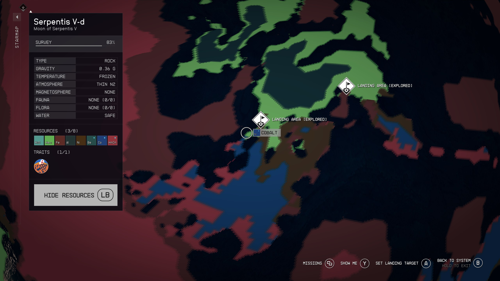
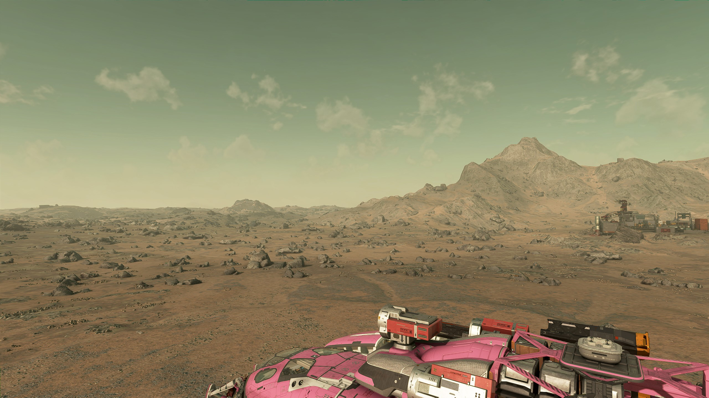
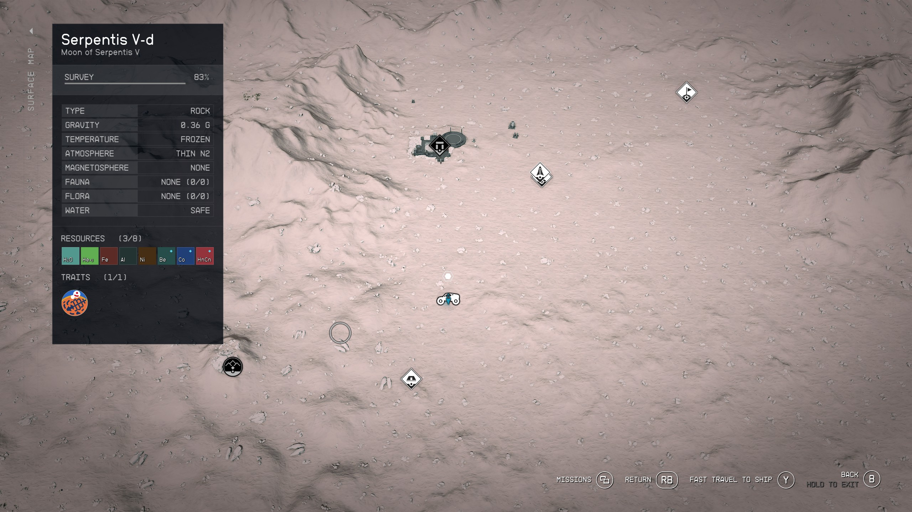
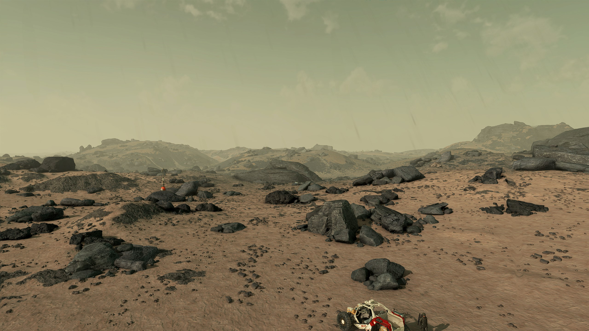
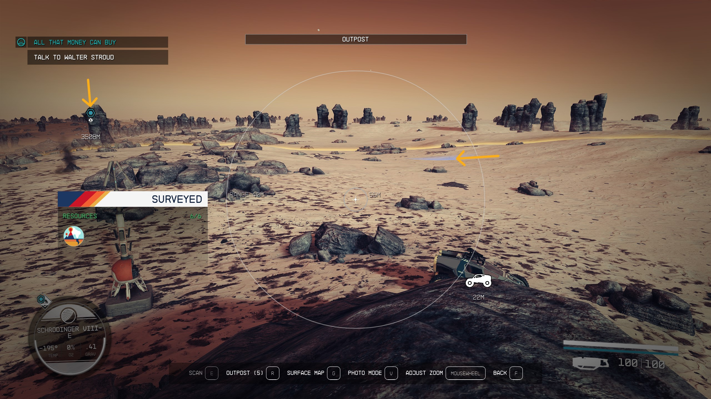
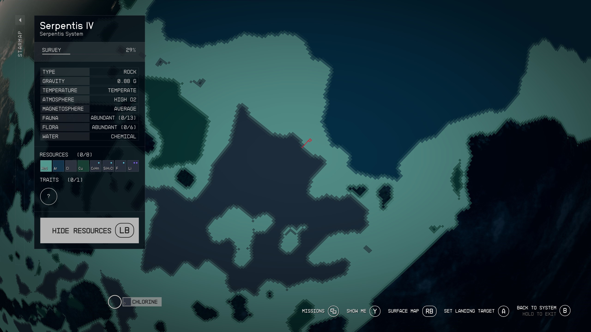

# Advanced Reactor Assembly Line

- [Advanced Reactor Assembly Line](#advanced-reactor-assembly-line)
  - [Overview](#overview)
  - [Reactor Production](#reactor-production)
    - [Andraphon (He3 Infrastructure)](#andraphon-he3-infrastructure)
    - [Procyon III (Isotopic Coolant/Antimicrobial expansion)](#procyon-iii-isotopic-coolantantimicrobial-expansion)
    - [Cruth (Semimetal Wafer, Paramagnon Conductor)](#cruth-semimetal-wafer-paramagnon-conductor)
    - [Codos (Solvent)](#codos-solvent)
    - [Serpentis V-d (He3/SupColMag)](#serpentis-v-d-he3supcolmag)
    - [Schrodinger VIII-e (control rod)](#schrodinger-viii-e-control-rod)
    - [Grimsey (Iridium, Plutonium, Uranium, Vanadium)](#grimsey-iridium-plutonium-uranium-vanadium)
    - [Operation](#operation)
  - [Industrial Liquid Extractors and Greenhouses](#industrial-liquid-extractors-and-greenhouses)
    - [Molecular Sieve](#molecular-sieve)
      - [Home Base (Austenitic Manifold, Mag Pressure Tank)](#home-base-austenitic-manifold-mag-pressure-tank)
      - [Serpentis IV (membrane, molecular sieve)](#serpentis-iv-membrane-molecular-sieve)
    - [Sterile Nanotubes](#sterile-nanotubes)
      - [Serpentis IV (sterile nanotubes)](#serpentis-iv-sterile-nanotubes)
    - [Substrate Molecule Sieve](#substrate-molecule-sieve)
      - [Alpha Andraste III (biosuppressant, Chlorosilanes, Cl, Xe)](#alpha-andraste-iii-biosuppressant-chlorosilanes-cl-xe)
      - [Serpentis IV (fibre and water expansion)](#serpentis-iv-fibre-and-water-expansion)
      - [Fermi VII-a (Memory Substrate)](#fermi-vii-a-memory-substrate)
      - [Serpentis IV (substrate molecule sieve)](#serpentis-iv-substrate-molecule-sieve)
    - [Veryl-Treated Manifold](#veryl-treated-manifold)
      - [Verne I (neon, veryl)](#verne-i-neon-veryl)
      - [Alpha Tirna VIII-c (Lubricant expansion)](#alpha-tirna-viii-c-lubricant-expansion)
      - [Serpentis IV (veryl-treated manifold)](#serpentis-iv-veryl-treated-manifold)
  - [Industrial Solid Extractors](#industrial-solid-extractors)
    - [Schrodinger II (aldumite)](#schrodinger-ii-aldumite)
    - [Andraphon (He3/Be/Eu)](#andraphon-he3beeu)
  - [Advanced Reactor Production](#advanced-reactor-production)
    - [Operation](#operation-1)
    - [Experience grinding](#experience-grinding)
    - [Shoza VII-c (palladium)](#shoza-vii-c-palladium)
    - [Maal IX-b (positron battery)](#maal-ix-b-positron-battery)
    - [Shoza VIII-b (Power Circuit)](#shoza-viii-b-power-circuit)
    - [Katydid III (Indicite)](#katydid-iii-indicite)
    - [Zeta Ophiuchi I (polymer, silver exports)](#zeta-ophiuchi-i-polymer-silver-exports)
    - [Cruth (cargo link expansion)](#cruth-cargo-link-expansion)
    - [Dalvik (Caesium)](#dalvik-caesium)
    - [Decaran VII-b (Vytinium)](#decaran-vii-b-vytinium)
    - [Carinae III-a (Rothicite)](#carinae-iii-a-rothicite)
    - [Huygens VII-a (Tasine)](#huygens-vii-a-tasine)
    - [Shoza VIII-b (tasine superconductor)](#shoza-viii-b-tasine-superconductor)
    - [Grimsey (Vytinium Fuel Rod)](#grimsey-vytinium-fuel-rod)
    - [Grimsey (storage expansion)](#grimsey-storage-expansion)
    - [Procyon III Expansion (Isotopic Coolant, Copper to Bessel III-b)](#procyon-iii-expansion-isotopic-coolant-copper-to-bessel-iii-b)
    - [Bessel III-b Expansion (manufacturing, cargo links)](#bessel-iii-b-expansion-manufacturing-cargo-links)
    - [Zeta Ophiuchi I (Polymer, Silver, Ytterbium)](#zeta-ophiuchi-i-polymer-silver-ytterbium)
    - [Shoza III-a (He3 expansion)](#shoza-iii-a-he3-expansion)
  - [Mass Production Upgrades](#mass-production-upgrades)
    - [Cruth (Mass Production of Semimetal Wafers)](#cruth-mass-production-of-semimetal-wafers)
    - [Decaran (extraction upgrade)](#decaran-extraction-upgrade)
    - [Codos (production upgrade)](#codos-production-upgrade)
  - [Other Sites](#other-sites)
    - [Leviathan II (He3/Be/Eu/Nd)](#leviathan-ii-he3beeund)
  - [References](#references)

## Overview

In this document you'll build upon the *Industry from Scratch* infrastructure to:

- Build Reactors using manual logistics
- Build Advanced Reactors using manual logistics
- Add better production capacity through Industrial extractors, greenhouses and animal husbandry facilities
- Add cargo links to automate most of the logistics
- Scale up production to be able to produce 700 Vytinium Fuel Rods every two days for the XP grind

## Reactor Production

As a stepping stone from *Industry from Scratch* to the Advanced Reactor Production chain, having the capacity to build normal reactors is useful. They produce a fixed 30 power which is great for those worlds where wind turbines and solar arrays are especially weak (airless worlds with dim light).

This manufacturing system is automated simply because schlepping around the starfield to pick up some parts here and other parts there is annoying enough without having to pick up feed stock from one planet and ship it to another.

Recipe for Reactors:

- Adaptive Frame: 6
- Control Rod: 3
  - Austenitic Manifold: 1
  - Dysprosium: 3
  - Isotopic Coolant: 1
- Lead: 10
- Nuclear Fuel Rod: 8
  - Semimetal Wafer: 1
  - Solvent: 2
  - Uranium: 3
- Paramagnon Conductor: 4
  - Gold: 1
  - Neodymium: 1
  - Zero Wire: 3
- Supercooled Magnet: 5
  - Isocentered Magnet: 1
  - Isotopic Coolant: 1
  - Neodymium: 3
- Tau Grade Rheostat: 3

### Andraphon (He3 Infrastructure)

Design:

- 2 Cargo Link (He3 to Grimsey, He3 to Cruth)
- 2 Extractor - Gas (he3)
- 1 Solar Dome (12 power)

Materials:

- Manufactured
  - Tau Grade Rheostat: 2
  - Zero Wire: 4
- Solid
  - Aluminum: 38
  - Beryllium: 4
  - Copper: 6
  - Iron: 40
  - Nickel: 8

### Procyon III (Isotopic Coolant/Antimicrobial expansion)

Upgade the infrastructure at Procyon III to produce Isotopic Coolant and Antimicrobial. The isotopic coolant will be required for reactors, antimicrobial is useful elsewhere.

Design:

- 2 Wind Turbine - Advanced (25 power)
- 2 Extractor - Gas (fluorine, tetrafluoride)
- 2 Storage - Gas - Large (fluorine, tetrafluoride)
- 3 Extractor - Liquid (Ionic Liquid, 2 water)
- 2 Storage - Liquid - Large (ionic liquid, water)
- 2 Greenhouse (antimicrobial, sealant)
- 3 Storage - Solid - Large (copper, antimicrobial, sealant)
- Simple Fabricator (isotopic coolant)
- Warehouse - Large (isotopic coolant)
- Cargo Link - Inter-system (isotopic coolant to Serpentis V-d)

Bill of Materials:

- Manufactured
  - Adaptive Frame: 90
  - Comm Relay: 1
  - Isocentered Magnet: 4
  - Reactive Gauge: 9
  - Zero Wire: 3
- Solid
  - Aluminum: 163
  - Copper: 46
  - Iron: 89
  - Nickel: 52
  - Sealant: 8
  - Titanium: 16
  - Tungsten: 36
- Gas
  - Fluorine: 8

### Cruth (Semimetal Wafer, Paramagnon Conductor)

Note how many solar domes are required to produce the power required just for the startup phase of this outpost.

Design:

- Landing Pad - Small
- 11 Solar Dome (4 power)
- 3 Extractor - Solid (antimony, gold, copper)
- 5 Storage - Solid - Large (antimony, copper, gold, neodymium, silver)
- 1 Extractor - Gas (fluorine)
- Storage - Solid - Gas (fluorine)
- Simple Fabricator (zero wire)
- 3 Warehouse - Large (zero wire, semimetal wafers, paramagnon conductor)
- 2 Compound Fabricator (semimetal wafer, paramagnon conductor)
- 2 Cargo Link (semimetal wafer to Grimsey, he3 from Andraphon)
- 2 Cargo Link - Inter-system (silver from Zeta Ophiuchi I, neodymium from Shoza III-a)

Materials:

- Manufactured
  - Adaptive Frame: 80
  - Comm Relay: 2
  - Isotopic Coolant: 4
  - Reactive Gauge: 6
  - Tau Grade Rheostat: 22
  - Zero Wire: 17
- Solid
  - Adhesive: 8
  - Aluminum: 265
  - Beryllium: 4
  - Copper: 3
  - Iron: 215
  - Nickel: 4
  - Sealant: 2
  - Titanium: 48
  - Tungsten: 26

Location:

Location of Cruth outpost isn't important, just plonk it down on a large yellow patch (Gold, Antimony, Copper). All the resources this outpost needs are in a single biome.

### Codos (Solvent)

[Codos](https://inara.cz/starfield/starsystem/10/#area1158) is a nice place for a **solvent**-producing outpost, being the only domesticable plant-based solvent supply. It should be possible to find a location that also produces Carboxylic Acids (R-COOH) which are useful for research and weapon mods.

Design:

- Landing Pad with Shipbuilder
- Wind Turbine - Advanced (14 power)
- Extractor - Liquid (water)
- Storage - Liquid - Large (water)
- Greenhouse (solvent)
- 1 Storage - Solid - Large (solvent)
- 1 Cargo Link - Inter-system (Solvent to Grimsey)

Materials:

- Manufactured
  - Adaptive Frame: 43
  - Comm Relay: 1
  - Isocentered Magnet: 2
  - Reactive Gauge: 6
  - Zero Wire: 2
- Solid
  - Aluminum: 58
  - Beryllium: 2
  - Iron: 73
  - Nickel: 20
  - Sealant: 3
- Gas
  - Fluorine: 4

### Serpentis V-d (He3/SupColMag)

Design:

- Industrial Workbench
- 4 Solar Dome (8 power)
- Extractor - Gas (helium-3)
- Storage - Gas - Large (He3)
- 2 Extractor - Solid (Nickel, Cobalt)
- 4 Storage - Solid - Large (Co, Ni, Nd)
- 3 Warehouse - Large (Isotopic Coolant, Isocentered Magnet, Supercooled Magnet)
- Simple Fabricator (isocentered magnet)
- Compound Fabricator (supercooled magnet)
- 3 Cargo Link - Inter-system (Neodymium from Shoza III-a, Isotopic Coolant from Procyon III, Supercooled Magnets to Schrodinger VIII-e)

Materials:

- Manufactured
  - Adaptive Frame: 80
  - Comm Relay: 3
  - Isotopic Coolant: 2
  - Reactive Gauge: 9
  - Tau Grade Rheostat: 8
  - Zero Wire: 8
- Solid
  - Adhesive: 4
  - Aluminum: 201
  - Copper: 23
  - Iron: 153
  - Nickel: 4
  - Sealant: 2
  - Titanium: 48
  - Tungsten: 32

Location:

The resources needed for this outpost are Co/Ni and He3. You'll find Co/Ni in the Hills biome, He3 in the craters biome. In the surface map you'll find a confluence of craters, hills and mountains along the left edge of the litte green nubbin, craters down the centre, hills south (down) from that, mountains west (left) of the craters. The landing site is on the mountains side of craters/mountains border. This outpost has He3, Ni, Co, Al, Be.

### Schrodinger VIII-e (control rod)

This is a manual production site as part of the XP grind. Produce Control Rods using Dysprosium. The lithium will be used for Rothicite Magnets later.

If you haven't set up the lubricant production on Alpha Tirna VIII-c as part of the Veryl-Treated Manifold production chain, you should be able to get lubricant from Sieghart, Trade Authority.

Design:

- Reactor
- 3 Cargo Link - Inter-system (austenitic manifold from Bessel III-b, isotopic coolant from Procyon III, he3 from Andraphon)
- 3 Extractor - Solid (lead, lithium, dysprosium)
- 3 Storage - Solid - Large (dysprosium, lead, lithium)
- 1 Storage - Gas - Large (he3)
- 6 Warehouse - Large (austenitic manifold, isotopic coolant, supercooled magnet)
- 1 Compound Fabricator (control rod)
- 1 Multiplex Fabricator (rothicite magnet)

Materials:

- Manufactured
  - Adaptive Frame: 116
  - Comm Relay: 6
  - Control Rod: 3
  - Isotopic Coolant: 2
  - Nuclear Fuel Rod: 8
  - Paramagnon Conductor: 4
  - Positron Battery: 3
  - Reactive Gauge: 18
  - Supercooled Magnet: 5
  - Tau Grade Rheostat: 3
  - Zero Wire: 5
- Solid
  - Adhesive: 4
  - Aluminum: 264
  - Copper: 20
  - Iron: 210
  - Lead: 10
  - Lubricant: 6
  - Polymer: 8
  - Titanium: 104
  - Tungsten: 28

Cargo links:

- He3 from Shoza III-a He3/Nd
- Austenitic Manifold from Bessel III-b Manifolds
- Isotopic Coolant from Procyon III
- Semimetal Wafer from Cruth
- Supercooled Magnet from Serpentis V-d He3/Supcolmag
- Rothicite from Carinae III-a Rothicite

Location:

In the southern hemisphere, find this region. The landing spot is on the **rocky desert** side of the mountains/rocky desert/frozen hills biome border. When you land the ship should be on dirt close to the snowline, the landscape should be predominantly flat with stone pillars and a small mound in the middle distance in the snow-covered region. Opposite from the snowline will be a hot springs geographic feature which you should have seen during the landing animation.

From the landing site, follow the snowline north for about 3km. Half way there (1.6km) you'll pass a large dysprosium patch that crosses the snowline, then eventually come to a snow-covered region that is relatively void of stone pillars. One last stone pillar on the snow side of the border (left, in the direction of travel), and there will be a large slab of rock perched on the hillside.

The final image shows a view from the top of that large rock back towards the ship. At this location you can place an outpost and have access to Dysprosium, Lead and Lithium. The lithium and dysprosium are at opposite edges of the outpost building range, you may have to finesse the location a little to get comfortable access to both.

This is a low-grav world, you'll find it much easier driving on the dirt than the snow. Of course if power sliding is your thing, there's plenty of snow to play in.

### Grimsey (Iridium, Plutonium, Uranium, Vanadium)

Set Grimsey up as a location for manually producing Nuclear Fuel Rod. This will grow over time to become a manufacturing site for Vytinium Fuel Rods.

Design:

- Landing Pad - Small
- Industrial Workbench
- 4 Solar Dome (6 power)
- 4 Extractor - Solid (iridium, plutonium, uranium, vanadium)
- 6 Storage - Solid - Large (iridium, lead, plutonium, solvent, uranium, vanadium)
- 3 Warehouse - Large (control rod, paramagnon conductor, semimetal wafer)
- 2 Cargo link (semimetal wafer from cruth, he3 from Andraphon)
- Cargo Link - Inter-system (solvent from Codos)

Materials:

- Manufactured
  - Adaptive Frame: 90
  - Comm Relay: 1
  - Reactive Gauge: 3
  - Tau Grade Rheostat: 8
- Solid
  - Aluminum: 212
  - Iron: 183
  - Titanium: 48
  - Tungsten: 8

Location:

All the resources we need from Grimsey are in one biome. Just find somewhere relatively flat in an area with accessible iridium, plutonium, uranium and vanadium deposits.

### Operation

Run a route to pick up materials and manufacture components on the way:

- Collect 10 Lead, 3 Control Rods, 5 Supercooled Magnet from Schrodinger VIII-e
- Collect 6 Adaptive Frame, 3 Tau Grade Rheostat from Bessel III-b
- Collect 4 Paramagnon Conductor from Cruth
- Craft 8 Nuclear Fuel Rods at Grimsey
- Build reactor, then demolish it (ensures you have all the parts, leaves materials in your inventory)
- Head to site to build reactor

## Industrial Liquid Extractors and Greenhouses

The larger project ahead is mass producing Vytinium Fuel Rods (an XP and money grind). For that project it would be nice to have better extraction technology. This immediate project is oriented towards producing Veryl-Treated Manifold and Substrate Molecule Sieve. These components allow construction of industrial liquid and gas extractors, and industrial greenhouses. These will be useful for materials such as Solvent.

Note that for the quantities required in any playthrough it might be easier just buying the Substrate Molecule Sieve and Veryl-Treated Manifold from the stores that stock them. Setting up the outposts to collect the unique resources is extra labour.

Stores that sometimes stock rarer parts:

- Clint's, Gagarin Landing
- Outland, New Atlantis
- UC Exchange, Cydonia
- Sieghart's, Neon
- Shepherd's, Akila City
- The Trader

Materials for Liquid Extractor - Industrial:

- 5 Adaptive Frame (1.6kg)
- 2 Substrate Molecule Sieve (4.5kg)
  - Biosuppressant
  - Memory Substrate
  - Molecular Sieve
  - Sterile Nanotube
- 6 Titanium (0.5kg)
- 3 Veryl-Treated Manifold (5.4kg)
  - Austenitic Manifold
  - Lubricant
  - 2 Veryl
  - Ytterbium

### Molecular Sieve

Molecular Sieve requires the following components:

- 2 Ionic Liquid
- 1 Mag Pressure Tank
  - 2 Aluminium
  - 1 Nickel
- 2 Membrane

#### Home Base (Austenitic Manifold, Mag Pressure Tank)

Design:

- Reactor
- 2 Simple Fabricator (Austenitic Manifold, Mag Pressure Tank)
- 2 Warehouse - Large (Austenitic Manifold, Mag Pressure Tank)

Materials:

- Adaptive Frame: 16
- Aluminum: 28
- Control Rod: 3
- Lead: 10
- Nuclear Fuel Rod: 8
- Paramagnon Conductor: 4
- Sealant: 2
- Supercooled Magnet: 5
- Tau Grade Rheostat: 3
- Titanium: 16
- Tungsten: 4
- Zero Wire: 3

#### Serpentis IV (membrane, molecular sieve)

[Serpentis IV](https://inara.cz/starfield/starsystem/47/#area1892) has a domesticable animal that produces **Membrane**. Water is available locally. This base can be expanded over time to produce water, fiber, metabolic agent, sealant, toxin, analgesic, argon, lithium. In most playthroughs I'll end up building a pharamceutical lab here.

Design:

- 3 Wind Turbine - Advanced (25 power)
- 5 Extractor - Liquid (water)
- 1 Storage - Liquid - Large (water)
- 2 Greenhouse (fiber)
- 2 Animal Husbandry Facility (membrane, sealant)
- 4 Storage - Solid - Large (2 fiber, membrane, sealant)
- Storage - Liquid - Large (ionic liquids)
- Compound Fabricator (molecular sieve)
- 2 Warehouse - Small (mag pressure tank, molecular sieve)

Materials:

- Manufactured
  - Adaptive Frame: 111
  - Isocentered Magnet: 6
  - Isotopic Coolant: 2
  - Reactive Gauge: 15
  - Zero Wire: 5
- Solid
  - Adhesive: 4
  - Aluminum: 210
  - Copper: 26
  - Iron: 140
  - Nickel: 60
  - Sealant: 15
  - Titanium: 10
  - Tungsten: 26
- Gas
  - Fluorine: 12

Location:

My favoured spots are along the "frozen crevasses" side of the frozen crevasse/savanna borders. When you land you should see both savanna and frozen crevasse landscape. With a bit of hunting you'll find a spot with Argon, Benzene and Lithium. With a bit more luck you'll find Chlorosilanes too, though they're not needed for much.

### Sterile Nanotubes

To produce Sterile Nanotubes we need:

- 1 Molecular Sieve
- 2 Solvent
- 2 Vanadium

#### Serpentis IV (sterile nanotubes)

Import solvent from Codos, Vanadium from Grimsey.

Design:

- Wind Turbine - Advanced (25 power)
- 2 Storage - Solid - Large (solvent, vanadium)
- Compound Fabricator (sterile nanotubes)
- Warehouse - small (sterile nanotubes)

Materials:

- Manufactured
  - Adaptive Frame: 20
  - Isocentered Magnet: 2
  - Isotopic Coolant: 2
  - Zero Wire: 5
- Solid
  - Adhesive: 4
  - Aluminum: 37
  - Iron: 40
  - Tungsten: 8

### Substrate Molecule Sieve

These are needed for industrial water extractors and industrial greenhouses.

- 2 Biosuppressant
- 3 Memory Substrate
- 1 Molecular Sieve
- 2 Sterile Nanotubes

#### Alpha Andraste III (biosuppressant, Chlorosilanes, Cl, Xe)

[Alpha Andraste III](https://inara.cz/starfield/starsystem/25/#area1284) has a domesticable source of **Biosuppressant**.

Biosuppressant is used for a few mods, Substrate Molecule Sieve and Repairing Immobiliser. Over the entire course of the game you'll likely use a hundred or so, this is another outpost where you can happily fill up the storage, collect one full load and then remove the outpost.

Design:

- Landing Pad with Shipbuilder
- Wind Turbine - Advanced (25 power)
- 2 Extractor - Liquid (water, chlorosilanes)
- 2 Storage - Liquid - Medium (water, chlorosilanes)
- Greenhouse (biosuppressant)
- Storage - Solid - Large (biosuppressant)
- 2 Extractor - Gas (xenon, chlorine)
- 2 Storage - Gas - Medium (xenon, chlorine)

Materials:

- Manufactured
  - Adaptive Frame: 53
  - Isocentered Magnet: 2
  - Reactive Gauge: 3
  - Zero Wire: 2
- Solid
  - Aluminum: 61
  - Beryllium: 2
  - Copper: 26
  - Iron: 56
  - Nickel: 32
  - Sealant: 3
  - Tungsten: 16
- Gas
  - Fluorine: 4

#### Serpentis IV (fibre and water expansion)

To get Memory Substrate production at Fermi VII-a working we need a surplus of fibre and water. Serpentis is already producing both, this expansion is just to provide surplus.

NB: connect these to each other isolated from the local production chain. This production chain is specifically for Fermi VII-a inputs.

Design:

- Greenhouse (fiber)
- Extractor - Liquid (water)
- Storage - Liquid - Large (water)
- 2 Storage - Solid - Large (fiber)
- Wind Turbine - Advanced (25 power)

Materials:

- Manufactured
  - Adaptive Frame: 25
  - Isocentered Magnet: 2
  - Reactive Gauge: 3
- Solid
  - Aluminum: 46
  - Iron: 23
  - Nickel: 20
  - Sealant: 3
- Gas
  - Fluorine: 4

#### Fermi VII-a (Memory Substrate)

[Fermi VII-a](https://inara.cz/starfield/starsystem/73/#area185) is the only place we can produce **Memory Substrate**. Import two storages of fiber and 1 of water (expand production at Procyon III or Serpentis IV), dump them in the large storage then come back to pick up the memory substrate. At that point delete the outpost, we won't be back. You need 3 Memory Substrate to make 1 Substrate Molecule Sieve, then 2 Substrate Molecule Sieve to make the industrial buildings of interest (extractors, greenhouses), which means 6 memory substrate for 1 building. With ~200 memory substrate from one load of fiber and water, you'll be able to make 30-odd buildings which is far more than this entire build guide needs. In fact I'd go so far as to say you could rely entirely on vendors for this material (if you weren't already relying on vendors for Substrate Molecule Sieve in the first place).

Design:

- 1 Wind Turbine - Advanced (14 power)
- 1 Animal Husbandry Facility (memory substrate)
- 3 Storage - Solid - Large (2 fiber, 1 memory substrate)
- 1 Storage - Liquid - Large (water)
- 1 Landing Pad - Small

Materials:

- Adaptive Frame: 45
- Aluminum: 89
- Iron: 80
- Isocentered Magnet: 2
- Nickel: 16
- Reactive Gauge: 3
- Sealant: 3

#### Serpentis IV (substrate molecule sieve)

Serpentis is already producing molecular sieve and sterile nanotubes.

Design:

- Wind Turbine - Advanced (25 power)
- Storage - Solid - Large (biosuppressant)
- Multiplex Fabricator (substrate molecule sieve)
- Warehouse - Small (substrate molecule sieve)

Materials:

- Manufactured
  - Adaptive Frame: 13
  - Isocentered Magnet: 2
  - Positron Battery: 3
- Solid
  - Aluminum: 27
  - Iron: 20
  - Lubricant: 6
  - Polymer: 8
  - Titanium: 13

### Veryl-Treated Manifold

- 1 Austenitic Manifold
- 2 Lubricant
- 4 Veryl
- 2 Ytterbium

#### Verne I (neon, veryl)

[Verne I](https://inara.cz/starfield/starsystem/22/#area390) is the unique source of **Veryl**.

Design:

- 1 Landing Pad with Shipbuilder
- 1 Wind Turbine - Advanced (25 power)
- 2 Extractor - Gas (neon, veryl)
- 2 Storage - Gas - Large (neon, veryl)

Materials:

- Manufactured
  - Adaptive Frame: 38
  - Isocentered Magnet: 2
  - Zero Wire: 2
- Solid
  - Aluminum: 15
  - Beryllium: 2
  - Copper: 46
  - Iron: 30
  - Nickel: 8
  - Tungsten: 32

#### Alpha Tirna VIII-c (Lubricant expansion)

[Alpha Tirna VIII-c](https://inara.cz/starfield/starsystem/51/#area1536) has domesticable **lubricant** source along with Antimicrobial, Fiber, Sealant, Tantalum, Titanium, Tungsten.

I've already set up Alpha Tirna VIII-c for the metals. Livestock will require water which can only be obtained through vapor extractors, and fiber which can be grown locally:

- 2 Extractor - Liquid Vapor (water)
- 1 Storage - Liquid (water)
- 1 Greenhouse (fiber)
- 2 Storage - Solid - Large (fiber, lubricant)
- 1 Animal Husbandry Facility (lubricant)

Materials:

- Manufactured
  - Adaptive Frame: 33
  - Reactive Gauge: 6
- Solid
  - Aluminum: 56
  - Iron: 40
  - Membrane: 8
  - Nickel: 5
  - Sealant: 6
- Gas
  - Benzene: 6
  - Fluorine: 4

#### Serpentis IV (veryl-treated manifold)

Set up the Transfer container as a feed-in for the various storages (see References: "Unlimited Storage & Automated Resources Guide").

The only materials you want in this storage system are feedstock for Substrate Molecule Sieve and Veryl-Treated Manifold as follows (source in parentheses):

- Austenitic Manifold (Bessel III-b)
- Biosuppressant (Alpha Andraste III)
- Ionic Liquids (Procyon II)
- Lubricant (Alpha Tirna VIII-c)
- Mag Pressure Tank (Bessel III-b)
- Membrane (Serpentis IV)
- Memory Substrate (Fermi VII-a)
- Solvent (Codos)
- Vanadium (Grimsey)
- Veryl (Verne I)
- Ytterbium (Zeta Ophiuchi I)

Monitor the fabricators in Outpost/Modify mode to ensure that you have sufficient quantities of the various inputs. The fabricators have enough storage internally to hold all the components you're likely to require.

Design:

- Wind Turbine - Advanced (25 power)
- Multiplex Fabricator (Veryl-Treated Manifold)
- Transfer Container
- 5 Storage - Liquid - Large (Ionic Liquid)
- 10 Storage - Solid - Large (Biosuppressant, Lubricant, Memory Substrate, Solvent, Titanium, Vanadium, Ytterbium)
- 5 Storage - Gas - Large (Veryl)
- 5 Warehouse - Large (Adaptive Frame, Austenitic Manifold, Mag Pressure Tank)

Materials:

- Manufactured
  - Adaptive Frame: 250
  - Isocentered Magnet: 2
  - Positron Battery: 3
- Solid
  - Aluminum: 365
  - Copper: 100
  - Iron: 208
  - Lubricant: 10
  - Nickel: 80
  - Polymer: 8
  - Titanium: 88
  - Tungsten: 85

## Industrial Solid Extractors

I'd go so far as to suggest that it's not worth the effort of building Aldumite Drilling Rig since you can get the quantities you need by [keeping an eye out for vendor supplies](https://inara.cz/starfield/resource/288/). Failing that, head to Schrodinger II, set up an outpost to collect a few hundred aldumite, remove that outpost and stow the aldumite away at Grimsey where you'll have an industry outpost ready to assemble the Aldumite Drilling Rig.

My order of preference for upgrades is:

- Build more of the simple extractors
- Build Sanitation Robots (10% extra production, multiplicative)
- Add crew with Outpost Management skill
- If more production is still required, upgrade to industrial extractors

The recipe for these:

- 5 Adaptive Frame
- 1 Aldumite Drilling Rig
  - 4 Aldumite (1.9kg)
  - 2 Caesium (0.8kg)
  - 1 Drilling Rig
    - 2 Lubricant
    - 1 Reactive Gauge
    - 3 Tungsten
  - 1 Microsecond Regulator
    - 4 Europium
    - 2 Lithium
    - 1 Supercooled Magnet
    - 1 Tau Grade Rheostat
- 4 Isotopic Coolant
- 6 Tungsten

I already collect Lubricant and Tungsten at Tirna VIII-c Ta/Ti/W/Alk/Lube, have Schrodinger VIII-e set up for Rothicite Magnets, so producing Drilling Rigs will consist of:

1. Pick up Reactive Gauge and Tau Grade Rheostat from Bessel III-b
2. Pick up Europium from Andraphon
3. Head to Tirna VIII-c outpost to construct Drilling Rig
4. Head to Schrodinger VIII-e to construct Microsecond Regulators
5. Pick up Aldumite from Schrodinger II (if you haven't already got a stash hidden away at Grimsey)
6. Head to Grimsey to construct Aldumite Drilling Rig
7. Drop Aldumite Drilling Rig off at home base. A large warehouse will store 42 Aldumite Drilling Rig

Vendors:

- Clint de Haven (Gagarin Landing)
- Outland (New Atlantis commercial district)
- Seighart's Outfitters (Neon)
- Shepherd's General (Akila City)
- Starborn Trader

### Schrodinger II (aldumite)

This is another one-and-done outpost. Once the storage has been filled, delete this outpost.

Design:

- Landing Pad - Small
- Solar Array (8 power)
- Extractor - Solid (aldumite)
- Storage - Solid - Large (aldumite)

Materials:

- Manufactured
  - Adaptive Frame: 10
- Solid
  - Aluminum: 32
  - Beryllium: 2
  - Copper: 3
  - Iron: 45
  - Tungsten: 2

### Andraphon (He3/Be/Eu)

Andraphon is a convenient location to collect He3 to drive the Grimsey and Cruth outposts.

Solar Array: 6
Wind Turbine: 0

Design:

- Landing Pad - Small
- 3 Solar Dome (12 power)
- Extractor - Solid (beryllium)
- Storage - Solid - Large (beryllium)
- 4 Extractor - Gas (He3)
- Storage - Gas - Large (He3)

Bill of Materials:

- Adaptive Frame: 20
- Aluminum: 60
- Copper: 32
- Iron: 45
- Nickel: 16
- Tau Grade Rheostat: 6
- Tungsten: 18

Location:

- Note that the outpost beacon is placed on a terrain (non-resource) gas vent.

TODO: update with new location: JRamosWorks Gaming Fun, [#Starfield Outposts - 5 Resources in One Spot on Andraphon | Great Starter Locations Video 1 of 4](https://www.youtube.com/watch?v=XEJNLgBUXVI)

## Advanced Reactor Production

Advanced reactors are great for outposts that require lots of industry. If you start deploying industrial extractors, they'll require 20 power to operate so you'll basically require an advanced reactor to provide the necessary power. On some worlds you'll get by just fine with wind turbines.

This project is really not about advanced reactors so much as it is about building outposts, setting up cargo links, and trying to figure out numbers for optimal production rates.

To build advanced reactors we need the following parts:

- Reactor - Advanced
  - 10 Adaptive Frame
  - 5 Control Rod
  - 20 Lead (14kg)
  - 3 Power Circuit
  - 5 Rothicite Magnet
  - 4 Tasine Superconductor
  - 8 Vytinium Fuel Rod

### Operation

To construct advanced reactors we need the parts for the following recipe:

In this section we'll expand the industrial base to produce those parts. Most of the production chain will be automated but cargo transfers will be manual. The next section will focus on why we add certain cargo links, and which links will be most important if you only have access to 3 cargo links per outpost (eg: you haven't upgraded Outpost Management, or NG+ has broken Outpost Management for you).

Once the upgrades in this section are complete:

1. Head to Grimsey and build 8 Vytinium Fuel Rods
  1. Build Indicite Wafers with half the available semimetal wafers
  2. Build Nuclear Fuel Rods with the remaining semimetal wafers
  3. Build all the Vytinium Fuel rods that resources allow
  4. Deposit remaining Indicite Wafers and Nuclear Fuel Rods in the warehouse
2. Head to Shoza VIII-b and build:
  - 3 Power Circuits
  - 4 Tasine Superconductors
3. Head to Schrodinger VIII-e and collect:
  - 5 Rothicite Magnets
  - 5 Control Rods
  - 20 Lead
4. Collect 10 Adaptive Frame from Bessel III-b

### Experience grinding

If you're trying to grind XP instead of build advanced reactors, just build the Vytinium Fuel Rods:

1. Go to Grimsey, wait for containers to fill, create VFR as above, keep going until you run out of supplies
2. Visit these planets to sell the VFR:
  - Valo > Polvo > Hopetown
    - Pit Stop > Fast Hoang 11000 (82)
    - Carlos Shenton 4500 (33)
  - Cheyenne > Akila > Akila City
    - Emerson Shepherd 5000 (37)
    - Trade Authority 11000 (82)
  - Porrima > Porrima III > Red Mile
    - Sati Chandra (bartender) 11000 (82) (watch out for caraffe on the bench in front of her, quicksave on landing)
  - Volii > Volii Alpha > Neon Core
    - Trade Authority 11000 (82)
    - Newill's (as you leave TA, mining league is across the way, then to the right is Freestar Rangers then Newill's) 
    - Mining League 5000 (37)
    - Sieghart's Outfitters 5000 (37)
  - Alpha Centauri > Jemison > New Atlantis
    - Jemison Mercantile 5000 (37)
    - The Well > Trade Authority 11000 (82)
    - Commercial District > Outland
  - Sol > Mars > Cydonia
    - Trade Authority 11000 (82)
    - UC Exchange (varies)
  - Wolf > Cthonia > The Den
    - Trade Authority 11000 (82)

That's 755 VFR in one trip. Each VFR represents 4XP for Nuclear Fuel Rod, 10XP for Indicite Wafer, 14XP for the VFR build for a total of 28XP.

### Shoza VII-c (palladium)

Design:

- Landing Pad with Shipbuilder
- Solar Dome
- Extractor - Solid (Pd)
- Storage - Solid - Large (Pd)
- Cargo Link (Pd to Shoza VIII-b)

Materials:

- Adaptive Frame: 28
- Aluminum: 36
- Beryllium: 4
- Iron: 75
- Tau Grade Rheostat: 2
- Tungsten: 2
- Zero Wire: 4

### Maal IX-b (positron battery)

Local power generation is 8 from a solar dome, 6 from a wind turbine - advanced, or 30 from a reactor.

Design:

- Landing Pad - Small
- Reactor
- 2 Extractor - Solid (antimony, vanadium)
- 2 Storage - Solid - Large (antimony, vanadium)
- 2 Warehouse - Large (tau grade rheostat, positron battery)
- Compound Fabricator (positron battery)
- Cargo Link - Inter-system (tau grade rheostat from Shoza VIII-b, positron battery to Shoza VIII-b)

Materials:

- Manufactured
  - Adaptive Frame: 46
  - Comm Relay: 1
  - Control Rod: 3
  - Isotopic Coolant: 2
  - Nuclear Fuel Rod: 8
  - Paramagnon Conductor: 4
  - Reactive Gauge: 3
  - Supercooled Magnet: 5
  - Tau Grade Rheostat: 3
  - Zero Wire: 5
- Solid
  - Adhesive: 4
  - Aluminum: 100
  - Iron: 90
  - Lead: 10
  - Titanium: 32
  - Tungsten: 12

Location:

Land on the Frozen Hills side of the Sandy Desert/Frozen Hills border. Head to the biome border and follow the snowline to the left, keep going for about 1.6km until you see the stone pillars rock formation. Outpost site is immediately behind and to the right, in the direction of travel.

NB: you should be able to find a similar spot on most frozen hills/sandy desert biome borders. This is just the one that I documented because I am lazy.

### Shoza VIII-b (Power Circuit)

Manually construct Power Circuit here to build advanced reactors:

- Palladium from Shoza VII-c
- Polymer from Zeta Ophiuchi I
- Positron Battery from Maal IX-b

Design:

- Landing Pad - Small
- 1 Reactor
- 4 Extractor - Solid (Al, Be, Cu, Au)
- 6 Storage - Solid - Large (Al, Be, Cu, Au, Pd, polymer)
- Simple Fabricator (tau grade rheostat)
- 4 Warehouse - Large (paramagnon conductor, positron battery, power circuit, tau grade rheostat)
- Multiplex Fabricator (power circuit)
- Cargo Link (Pd from Shoza VII-c)
- 1 Extractor - Gas (Helium-3)
- Storage - Gas - Large
- 4 Cargo Link - Inter-system (tau grade rheostat to Maal IX-b, positron battery from Maal IX-b, paramagnon conductor from Cruth, polymer from Zeta Ophiuchi I)

Materials:

- Manufactured
  - Adaptive Frame: 116
  - Comm Relay: 4
  - Control Rod: 3
  - Nuclear Fuel Rod: 8
  - Paramagnon Conductor: 4
  - Positron Battery: 3
  - Reactive Gauge: 12
  - Supercooled Magnet: 5
  - Tau Grade Rheostat: 3
  - Zero Wire: 5
- Solid
  - Aluminum: 273
  - Beryllium: 2
  - Copper: 23
  - Iron: 260
  - Lead: 10
  - Lubricant: 6
  - Nickel: 4
  - Polymer: 8
  - Sealant: 2
  - Titanium: 72
  - Tungsten: 28

Location:

Also see the "Advanced Reactor Assembly" document from MattGyver's "Starfield Manufacturing Flow Diagrams" which has a full page describing the location(s) at which you can build this outpost.

### Katydid III (Indicite)

Design:

- Wind Turbine - Advanced (14 power)
- Extractor - Solid (indicite)
- Storage - Solid - Large (indicite)
- Cargo Link - Inter-system (indicite to Grimsey)
- Landing Pad - Small

Materials:

- Manufactured
  - Adaptive Frame: 10
  - Comm Relay: 1
  - Isocentered Magnet: 2
  - Reactive Gauge: 3
- Solid
  - Aluminum: 45
  - Iron: 65
  - Tungsten: 2

Location:

Only one resource being collected here, just find somewhere you like that has indicite.

### Zeta Ophiuchi I (polymer, silver exports)

Design:

- 2 Cargo Link - Inter-system (silver to Cruth, polymer to Shoza VIII-b)

Materials:

- Manufactured
  - Comm Relay: 2
  - Reactive Gauge: 6
- Solid
  - Aluminum: 24
  - Iron: 40

### Cruth (cargo link expansion)

Design:

- Cargo Link (semimetal wafers to Grimsey)
- 4 Cargo Link - Inter-system (silver from Zeta Ophiuchi I, semimetal wafers to Schrodinger VIII-e, antimony to Shoza VIII-b, neodymium from Shoza III-a, He3 from Shoza III-a, paramagnon conductor to Shoza VIII-b)

Materials:

- Manufactured
  - Comm Relay: 4
  - Reactive Gauge: 12
  - Zero Wire: 2
- Solid
  - Aluminum: 60
  - Beryllium: 2
  - Iron: 100

### Dalvik (Caesium)

Design:

- Landing Pad - Small
- Cargo Link (caesium to grimsey)
- 2 Solar Dome (4 power)
- 1 Extractor - Liquid (caesium)
- 1 Storage - Liquid - Large (caesium)

Materials:

- Manufactured
  - Adaptive Frame: 10
  - Tau Grade Rheostat: 4
  - Zero Wire: 2
- Solid
  - Aluminum: 53
  - Beryllium: 2
  - Iron: 43
  - Nickel: 20

### Decaran VII-b (Vytinium)

- Landing Pad - Small
- 2 Solar Dome (4 power)
- Extractor - Solid (vytinium)
- Storage - Solid - Large (vytinium)
- Cargo Link - Inter-system (vytinium to grimsey)

Materials:

- Manufactured
  - Adaptive Frame: 10
  - Comm Relay: 1
  - Reactive Gauge: 3
  - Tau Grade Rheostat: 4
- Solid
  - Aluminum: 44
  - Iron: 60

Location: Not important, you should be able to fully survey the planet on one landing. Just land in a vytinium-rich area. There might be some utility in a 4-resource location on this world so here's a [Reddit post](https://old.reddit.com/r/Starfield/comments/17nbhmt/anyone_able_to_point_me_to_a_four_resource/k85fhn8/) purporting to show one.

### Carinae III-a (Rothicite)

Design:

- Landing Pad - Small
- Solar Dome (8 power)
- Extractor - Solid (rothicite)
- Storage - Solid - Large (rothicite)
- Cargo Link - Inter-system (rothicite to Schroedinger VIII-e)

Materials:

- Manufactured
  - Adaptive Frame: 10
  - Tau Grade Rheostat: 2
- Solid
  - Aluminum: 32
  - Iron: 45
  - Tungsten: 2

Location:

Any rothicite-rich area will do.

### Huygens VII-a (Tasine)

Design:

- Landing Pad - Small
- Extractor - Liquid (tasine)
- Storage - Liquid - Large (tasine)
- Solar Dome (8 power)
- Cargo Link - Inter-system (tasine to Shoza VIII-b)

Materials:

- Manufactured
  - Adaptive Frame: 10
  - Comm Relay: 1
  - Reactive Gauge: 3
  - Tau Grade Rheostat: 2
- Solid
  - Aluminum: 49
  - Iron: 43
  - Nickel: 20

Location:

Any tasine-rich area.

### Shoza VIII-b (tasine superconductor)

Design:

- Reactor
- 2 Cargo Link - Inter-system (tasine from Huygens VII-a, polymer from zeta ophiuchi i)
- 1 Storage - Liquid - Large (tasine)
- 1 Warehouse - Large (tasine superconductor)
- Multiplex Fabricator (tasine superconductor)

Materials:

- Reactor
- Manufactured
  - Adaptive Frame: 20
  - Comm Relay: 2
  - Positron Battery: 3
  - Reactive Gauge: 6
  - Zero Wire: 2
- Solid
  - Aluminum: 76
  - Beryllium: 2
  - Iron: 60
  - Lubricant: 6
  - Nickel: 16
  - Polymer: 8
  - Titanium: 24

### Grimsey (Vytinium Fuel Rod) 

Design:

- 2 Cargo Link - Inter-system (vytinium from decaran vii-b, indicite from katydid iii)
- 2 Storage - Solid - Large (indicite, vytinium)
- 1 Cargo Link (caesium from dalvik)
- 1 Storage - Liquid - Large (caesium)
- 1 Warehouse - Large (semimetal wafers)
- 1 Storage - Gas - Large (He3)

Materials:

- Manufactured
  - Adaptive Frame: 40
- Solid
  - Aluminum: 72
  - Iron: 40
  - Nickel: 16
  - Titanium: 16

### Grimsey (storage expansion)

By selling to all the Trade Authority vendors and the Red Mile bartender we should be able to clear 500 VFR sales per trip. As such, all storage is scaled to produce 500 VFR in one go. You can sell much more each trip if you are willing to visit each individual vendor.

Design:

- 8 Storage - Solid - Large (Vytinium)
- 7 Storage - Solid - Large (Indicite)
- 2 Storage - Solid - Large (Plutonium)
- 2 Storage - Solid - Large (Uranium)
- 17 Warehouse - Large (semimetal wafers)
- 3 Storage - Solid - Large (Iridium, Vanadium, Solvent)
- Storage - Liquid - Large (caesium)

Materials:

- Manufactured
  - Adaptive Frame: 400
- Solid
  - Aluminum: 712
  - Iron: 440
  - Nickel: 16
  - Titanium: 272

### Procyon III Expansion (Isotopic Coolant, Copper to Bessel III-b)

- Cargo Link - Inter-system (Copper to Bessel III-b)
- Cargo Link - Inter-system (Isotopic Coolant to Bessel III-b)

### Bessel III-b Expansion (manufacturing, cargo links)

Note that the austenitic manifold fabricator already exists if you followed the industrial liquid extractor build.

- Reactor
- Cargo Link - Inter-system (He from Andraphon)
- Storage - Gas - Large
- Cargo Link - Inter-system (Copper from Procyon III)
- Storage - Solid - Large (copper)
- Cargo Link - Inter-system (Neodymium from Shoza III-a)
- Storage - Solid - Large (neodymium)
- Cargo Link - Inter-system (Beryllium from Shoza III-a)
- Storage - Solid - Large (beryllium)
- Cargo Link - Inter-system (Isotopic Coolant from Procyon III)
- 6 Warehouse - Small (isotopic coolant, reactive gauge, austenitic manifold, tau grade rheostat, supercooled magnet)
- 5 Simple Fabricator (Austenitic Manifold, Isocentered Magnet, Reactive Gauge, Tau Grade Rheostat, supercooled magnet)

Materials:

- Manufactured
  - Adaptive Frame: 106
  - Comm Relay: 5
  - Control Rod: 3
  - Nuclear Fuel Rod: 8
  - Paramagnon Conductor: 4
  - Reactive Gauge: 15
  - Supercooled Magnet: 5
  - Tau Grade Rheostat: 3
  - Zero Wire: 15
- Solid
  - Aluminum: 268
  - Copper: 20
  - Iron: 160
  - Lead: 10
  - Sealant: 10
  - Titanium: 96
  - Tungsten: 36

### Zeta Ophiuchi I (Polymer, Silver, Ytterbium)

Design:

- Cargo Link - Inter-system (Silver to Bessel III-b)
- Cargo Link - Inter-system (Silver to Shoza VIII-b Power Circuits)
- Cargo Link - Inter-system (Polymer to Shoza VIII-b Power Circuits)
- 2 Wind Turbine - Advanced
- Extractor - Solid (silver)
- Extractor - Solid (ytterbium)
- Extractor - Liquid (water)
- 3 Storage - Solid - Large (silver, ytterbium, polymer)
- Storage - Liquid - Large (water)

Materials:

- Manufactured
  - Adaptive Frame: 40
  - Comm Relay: 3
  - Isocentered Magnet: 4
  - Reactive Gauge: 9
- Solid
  - Aluminum: 127
  - Iron: 133
  - Nickel: 20
  - Tungsten: 4

Location:

### Shoza III-a (He3 expansion)

Design:

- Cargo Link - Inter-system (He3 to Maal IX-b)
- Cargo Link - Inter-system (He3 to Schrodinger VIII-e)
- Cargo Link - Inter-system (He3 to Zeta Ophiuchi I)
- Cargo Link - Inter-system (Nd to Serpentis V-d)
- Cargo Link - Inter-system (Nd to Cruth)
- 2 Storage - Gas - Large
- 8 Extractor - Gas (helium-3)
- 4 Solar Dome (12 power)

Materials:

- Manufactured
  - Adaptive Frame: 20
  - Comm Relay: 2
  - Reactive Gauge: 6
  - Tau Grade Rheostat: 8
- Solid
  - Aluminum: 80
  - Copper: 64
  - Iron: 40
  - Nickel: 32
  - Tungsten: 32

## Mass Production Upgrades

From here, I chose to upgrade all the feeders to Grimsey to allow producing 500 Vytinium Fuel Rods every two days (the reset period for merchants).

If you skipped the production lines for Aldumite Drilling Rig and Veryl-Treated Manifold, important vendors to visit are the ones that might sell Aldumite Drilling Rig and Veryl-Treated Manifold:

- Outland, New Atlantis commercial district
- Clint's, Gagarin Landing
- UC Exchange, Cydonia
- Sieghart, Neon
- Shepherd, Akila City
- Trader
- Zuri and Isra, The Key

Start with Cruth, which produces the semi-metal wafers. The basic upgrade process for all sites is:

- Expand local storage to hold production requirements to meet 500 Vytinium Fuel Rods target
- Expand production to fill local storage in two days

Note that cargo links work in real time, while production happens in UT. If you sleep on Bessel III-b for a couple of hours all the production sites will fill up with materials, then the freighters will start hauling materials between cargo links once you wake up. This means you need adequate storage at both ends of each cargo link: storage for 500 semimetal wafers at Grimsey will also require storage for 500 semimetal wafers at Cruth.

In detail, expanding local storage means working back from the 500 Vytinium Fuel Rod target to find how much of each component and thus raw material is required (these numbers are not modified by skills):

- 500 Vytinium Fuel Rods (no storage, XP grind crafting, but 500 will be 5500kg)
  - 500 Indicite Wafer (no storage directly, the XP grind involves building these for XP)
    - 500 Caesium (800kg, 3 Storage - Liquid - Large)
    - 1000 Indicite (4600kg, 16 Storage - Solid - Large)
    - **500 Semimetal Wafer** (1750kg, 6 Warehouse - Large)
      - 1000 Antimony (800kg, 3 Storage - Solid - Large)
      - 1000 Gold (800kg, 3 Storage - Solid - Large)
      - 500 Zero Wire (850kg, 3 Warehouse - Large)
        - 500 Copper (300kg, 1 Storage - Solid - Large)
        - 500 Silver (300kg, 1 Storage - Solid - Large) )
    - 500 Solvent (500kg, 2 Storage - Solid - Large)
  - 500 Nuclear Fuel Rod (no storage directly, as above)
    - **500 Semimetal Wafer** (another 6 Warehouse - Large)
    - 1000 Solvent (another 2 Storage - Solid - Large)
    - 1500 Uranium (1050kg, 4 Storage - Solid - Large)
  - 1000 Plutonium (1600kg, 6 Storage - Solid - Large just for plutonium)
  - 2000 Vytinium (5000kg, 17 Storage - Solid - Large just for vytinium)

Most extraction sites will benefit from an Advanced Reactor or two. It can be easier to simply add more extractors rather than upgrading to industrial extractors. Switch to the industrial extractors when you run out of space for regular extractors. The same goes for greenhouses and animal husbandry facilities.

### Cruth (Mass Production of Semimetal Wafers)

From that 1000 Semimetal Wafer in 2 days figure, work back from the 12 warehouses full of Semimetal Wafer that are required, and build those warehouses at Grimsey and at Cruth. Then over at Cruth scale up the production chain to be able to build 1000 Semimetal Wafers in 48 hours UT (48 minutes game time, so 21 wafers per minute of play time). Note that production happens when you sleep or wait, but cargo links operate in "real time". Once you rest for 2 days the storage at Cruth will fill up, then the cargo links will bring the wafers to Grimsey at which point you'll be able to run through the manufacturing chain. Also worth noting is that the stock of semimetal wafers will take over half an hour to arrive (12 trips at 3 minutes each) which is most of the two days (48 minutes) you'll be waiting for the next trip through the vendors.

- 1000 Semimetal Wafers (21 per minute, 12 Warehouse - Large)
  - 2000 Antimony (42 per minute, 6 Storage - Solid - Large)
  - 2000 Gold (42 per minute, 6 Storage - Solid - Large)
  - 1000 Zero Wire (21 per minute, 6 Warehouse - Large)
    - 1000 Copper (21 per minute, 2 Storage - Solid - Large)
    - 1000 Silver (TBD, 2 Storage - Solid - Large)

Silver is produced elsewhere, so kick that can down the road.

The locally extracted resources are Copper, Antimony and Gold so empty their storage and see how much product appears after 10 minutes. My results are:

- Antimony (2 extractors) 30 = 15 each, 1.5/minute
- Copper (1 extractor) 37 = 37, 3.7/minute
- Gold (3 extractors) 56/3 = 18.7, 1.87/minute

Now it's a simple matter of dividing the desired rate by the rate per extractor then applying ceiling function (round any fractional extractor up to the next whole):

- Antimony 42/1.5 = 28
- Copper 21/3.7 = 5.676, round up to 6
- Gold 42/1.87 = 22.45, round up to 23

That's a lot of extractors. The number can be reduced slightly by using Sanitation Mini Bots to increase the production rate of inorganic resources by 10% (multiplicative, so 3 Sanitation Mini Bots will increase production by 33%), and assigning [Lin][INARALIN] to this outpost. This could trim the number of Antimony extractors required from 28 to 22. A further reduction could come from using industrial extractors, bringing that total down to 11. That's still 220 power required just for the Antimony extractors at this site!

Remember that the numbers in this section are indicative and will vary based on character skill, companions, robots, and glitches.

It may be useful to deploy in stages, bringing 1/4 of the total build online at any time: 1 advanced reactor, a few extractors, a few containers.

Design:

- 5 Reactor - Advanced
- 11 Extractor - Solid - Industrial (Antimony)
- 6 Extractor - Solid (Copper)
- 9 Extractor - Solid - Industrial (Gold)
- 6 Sanitation Mini Bot
- 18 Warehouse - Large (12 Semimetal Wafers, 6 Zero Wire)
- 16 Storage - Solid - Large (6 Antimony, 6 Gold, 2 Copper, 2 Silver)
- 1 Compound Fabriator (semimetal wafer)
- 1 Simple Fabricator (zero wire)

Materials:

- Manufactured
  - Adaptive Frame: 440
  - Aldumite Drilling Rig: 20
  - Control Rod: 25
  - Isotopic Coolant: 80
  - Power Circuit: 15
  - Rothicite Magnet: 25
  - Tasine Superconductor: 20
  - Vytinium Fuel Rod: 40
- Solid
  - Aluminum: 640
  - Iron: 350
  - Lead: 100
  - Titanium: 288
  - Tungsten: 132

### Decaran (extraction upgrade)

Producing 500 VFR every 48 hours requires 2000 Vytinium every 48 hours. A useful metric is the time it takes the freighter to travel back and forth which is about three minutes of real time, or about 30 min UT. Per-minute production is 2000 / 48 / 6, with 3 minutes between freight runs so 21 Vytinium per freighter.

Time to build an assay lab. This is simply going to be an industrial extractor feeding independent storage. Connect them together and watch the container for 10 minutes to get an initial estimate for production rate. Then empty the container and sleep for long enough to almost fill the container. Let's build the lab and then walk through the assay process.

Design:

- Reactor - Advanced
- Extractor - Solid - Industrial (vytinium)
- 2 Storage - Solid - Large (vytinium)

Materials:

- Manufactured
  - Adaptive Frame: 15
  - Aldumite Drilling Rig: 1
  - Control Rod: 5
  - Isotopic Coolant: 4
  - Power Circuit: 3
  - Rothicite Magnet: 5
  - Tasine Superconductor: 4
  - Vytinium Fuel Rod: 8
- Solid
  - Aluminum: 16
  - Iron: 20
  - Lead: 20
  - Tungsten: 6

For my experiment, the industrial extractor was producing 3 Vytinium per minute (10min UT). Vytinium has 2.5kg mass, which means about 120 will fit into a large storage container. At Decaran, 1 local hour is 45.5h UT, so resting for 1 local hour should mean the storage ends up containing 45.5 x 3 x 6 or roughly 810 vytinium, give or take.

I rested for 1 Decaran hour and came back to 425 units of vytinium. Something is wrong with those calculations, but what? It looks like 1 minute real time is 10 minutes UT, not 1h.

### Codos (production upgrade)

Set up an assay lab. Do the usual 10 minute observation. Then calculate required build-out on the basis of producing 500 solvent every 48h, roughly 11/h or 6 per freighter run.

Design:

- Wind Turbine - Advanced (power:14)
- Extractor - Liquid (water)
- Storage - Liquid - Large (water)
- Greenhouse (solvent)
- Storage - Solid - Large (solvent)

Materials:

- Manufactured
  - Adaptive Frame: 25
  - Isocentered Magnet: 2
  - Reactive Gauge: 3
- Solid
  - Aluminum: 46
  - Iron: 23
  - Nickel: 20
  - Sealant: 3
- Gas
  - Fluorine: 4

In my run, the greenhouse was producing 1 solvent every 1m25s (4.8/h UT). To get Codos to industrial level production in my game I should need two and a bit greenhouses.

## Other Sites

Here are some sites I had built out at some point but can't bear to remove from this document.

### Leviathan II (He3/Be/Eu/Nd)

I found Leviathan II outpost hard to reproduce, so rather than condemn future readers to spending several hours just finding the spot for one outpost we'll archive this plan.

Design:

- Landing Pad - Small
- 4 Solar Dome (16 power)
- Extractor - Solid (beryllium)
- Storage - Solid - Large (beryllium)
- Extractor - Solid (europium)
- Storage - Solid - Large (europium)
- Extractor - Solid (neodymium)
- Storage - Solid - Large (neodymium)
- 8 Extractor - Gas (He3)
- Storage - Gas - Large (He3)
- Cargo Link - Inter-system (He3 to Bessel III-b)
- Cargo Link - Inter-system (He3 to Grimsey)

Bill of Materials:

- Manufactured
  - Adaptive Frame: 40
  - Comm Relay: 2
  - Reactive Gauge: 6
  - Tau Grade Rheostat: 8
- Solid
  - Aluminum: 148
  - Copper: 44
  - Iron: 135
  - Nickel: 32
  - Tungsten: 22

Location:

It's possible to find a location here with Al/Be/Eu/He3/Nd, but it feels like the "Craters" biome on Leviathan II is actually three separate biomes of Craters with beryllium, Craters with aluminium and He3, and Craters with neodymium/europium. They do mix but generally speaking He3 is harder to find where Europium is easier to find and vice versa. I don't know if it's just confirmation bias but it seems to me that some terrain is slighly shinier and paler than the neighbouring terrain and that's the biome with Europium and Neodymium. YMMV.

## References

- [Starfield Unlimited Storage & Automated Resources Guide](https://www.youtube.com/watch?v=4PpCgF9RtY4)
- [Starfield Outpost Guide: Simplified Cargo Lnks & Gameplay Tips](https://www.youtube.com/watch?v=Vge2y-58lvk&list=PLgrQb2fZ1SEcQaD1Fw9g2Eq6ZjwrjixIU)
- [Starfield Outpost Guide: Simplified Cargo Links Inter System](https://www.youtube.com/watch?v=8aqUsuJJhN4&list=PLgrQb2fZ1SEcQaD1Fw9g2Eq6ZjwrjixIU&index=12)
- [Beginner's Guide to Outpost Building](https://www.youtube.com/watch?v=0CdDCPKychU)
- MattGyver [Starfield Outpost Pocket Reference](https://www.mattgyver.com/starfield-outpost)
- MattGyver [Starfield System Starmap v6](images/Starfield-System-Starmap-v6.png)
- MattGyver [Starfield Manufacturing Flow Diagrams](https://www.mattgyver.com/tutorials/2024/2/15/starfield-manufacturing-flow-diagrams)
- [Rafael character page][INARARAFAEL]
- [Lin character page][INARALIN]
- [Heller character page][INARAHELLER]
- [Andromeda character page][INARAANDROMEDA]

[INARAANDROMEDA]: https://inara.cz/starfield/companion/22/
[INARAHELLER]: https://inara.cz/starfield/companion/5/
[INARALIN]: https://inara.cz/starfield/companion/14/
[INARARAFAEL]: https://inara.cz/starfield/companion/62/