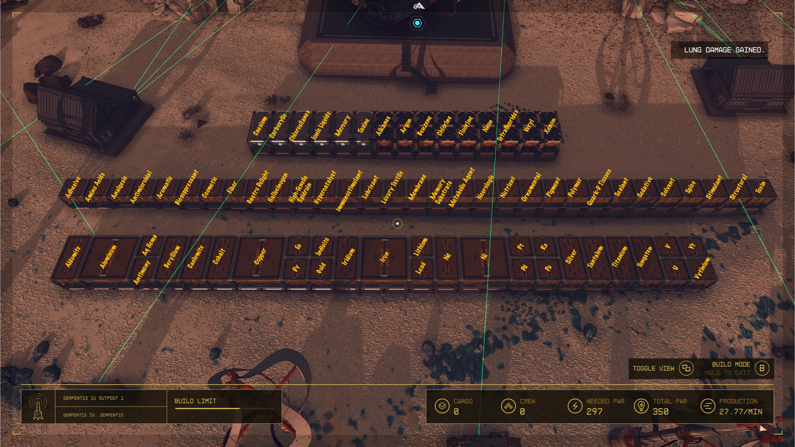

# Bessel III-b Storage

- Adhesive (solid, large)
- Aldumite (solid, small)
- Alkanes (gas, small)
- Aluminum (large)
- Amino Acids (small)
- Analgesic (small)
- Antimicrobial (small)
- Antimony (small)
- Aqueous Hematite (small)
- Argon (gas, small)
- Aromatic (solid, small)
- Benzene (gas, small)
- Beryllium (large)
- Biosuppressant (small)
- Caelumite (small)
- Caesium (liquid, small)
- Carboxylic Acids (liquid, small)
- Chlorine (gas, small)
- Chlorosilanes (liquid, small)
- Cobalt (large)
- Copper (large)
- Cosmetic (small)
- Dysprosium (small)
- Europium (small)
- Fiber (small)
- Fluorine (gas, small)
- Gastronomic Delight (small)
- Gold (small)
- Hallucinogen (small)
- High-Tensile Spidroin (small)
- Hypercatalyst (small)
- Immunostimulant (small)
- Indicite (small)
- Ionic Liquids (liquid, small)
- Iridium (small)
- Iron (large)
- Lead (small)
- Lithium (small)
- Lubricant (small)
- Luxury Textile (small)
- Membrane (small)
- Memory Substrate (small)
- Mercury (liquid, small)
- Metabolic Agent (small)
- Neodymium (small)
- Neon (gas, small)
- Neurologic (small)
- Nickel (large)
- Nutrient (small)
- Ornamental Material (small)
- Palladium (small)
- Pigment (small)
- Platinum (small)
- Plutonium (small)
- Polymer (small)
- Rothicite (small)
- Sealant (small)
- Sedative (small)
- Silver (small)
- Solvent (small)
- Spice (small)
- Stimulant (small)
- Structural Material (small)
- Tantalum (small)
- Tasine (gas, small)
- Tetrafluorides (gas, small)
- Titanium (large)
- Toxin (medium)
- Tungsten (large)
- Uranium (small)
- Vanadium (small)
- Veryl (gas, small)
- Vytinium (small)
- Water (liquid, large)
- Xenon (gas, small)
- Ytterbium (small)

