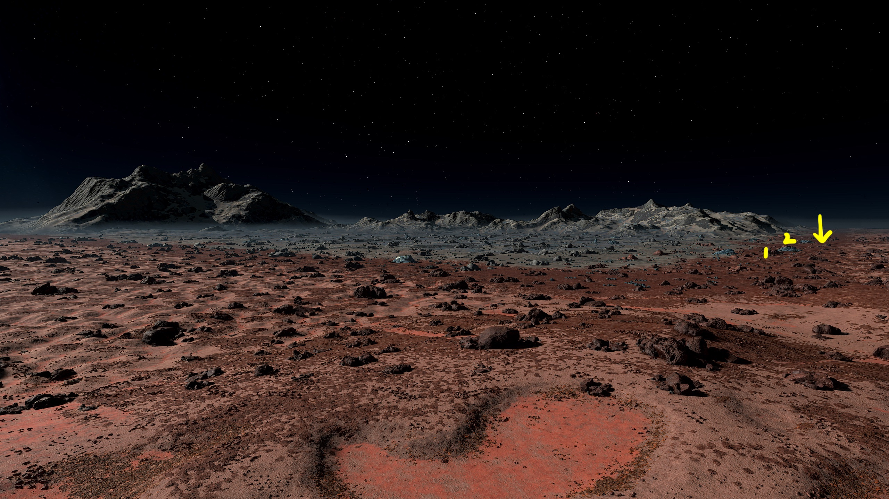
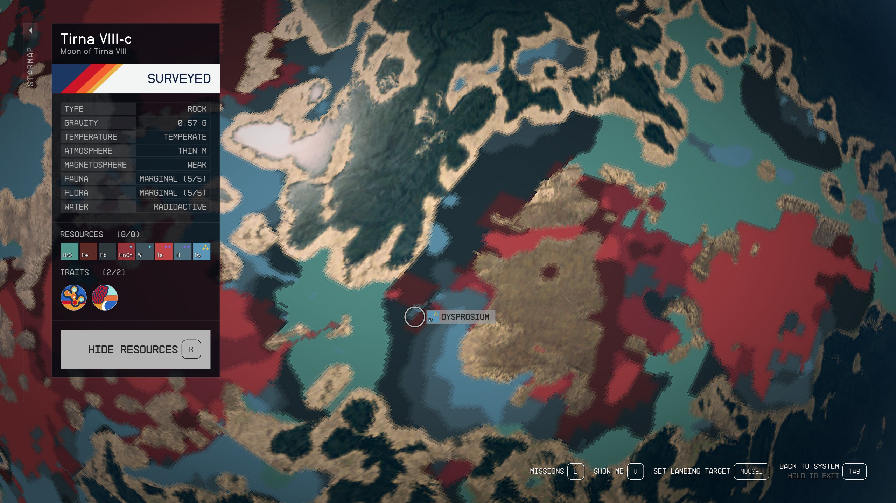
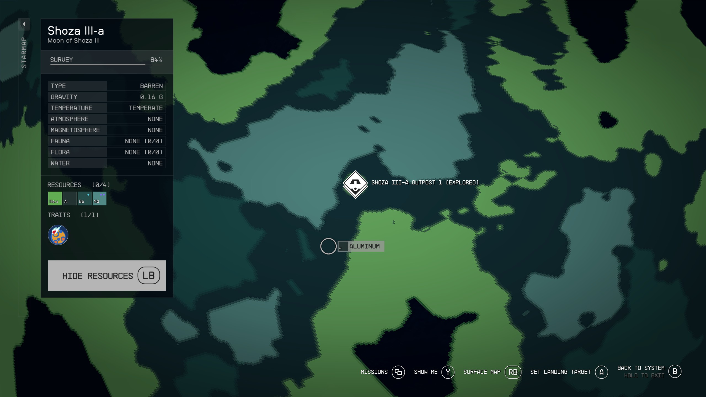

# Industry from Scratch

New Game, New You? Here's how to bootstrap your industry. Start off with a handful of Tungsten, building out basic resources and low tier manufactured goods:

- Bessel III-b for Al/Fe/Ni/Co
- Androphon for beryllium, europium and helium-3
- Procyon III for copper
- Alpha Tirna VIII-c titanium and tungsten
- Zeta Ophiuchi for silver
- Gagarin for adhesive
- Fabricators for Adaptive Frame, Isocentered Magnets and more
- Shoza III-a for neodymium and helium-3

From this you'll be able to construct most tier 1 manufactured goods. The process is entirely based on picking stuff up from each outpost and bringing it back to Bessel III-b for the moment, we'll start introducing cargo links and inter-system cargo links after Andraphon (or Leviathan II).

After that we'll proceed to producing Reactors as a stepping stone towards producing Advanced Reactors.

- [Industry from Scratch](#industry-from-scratch)
  - [Preparation](#preparation)
  - [Bessel III-b Al/Fe/Ni/Co](#bessel-iii-b-alfenico)
  - [Andraphon (He3/Be/Eu)](#andraphon-he3beeu)
  - [Procyon III (Cu, Sealant)](#procyon-iii-cu-sealant)
  - [Alpha Tirna VIII-c (Dy, Pb, Ta, Ti, W, Alkanes)](#alpha-tirna-viii-c-dy-pb-ta-ti-w-alkanes)
  - [Zeta Ophiucui I (silver, ytterbium, polymer)](#zeta-ophiucui-i-silver-ytterbium-polymer)
  - [Shoza III-a (He3, Be, Nd)](#shoza-iii-a-he3-be-nd)
  - [Serpentis IV (fiber, structural)](#serpentis-iv-fiber-structural)
  - [Home Base Industry Expansion](#home-base-industry-expansion)
    - [Further Expansion](#further-expansion)
  - [Sales Route](#sales-route)

## Preparation

Starting from the beginning of the game, I will typically go through the Constellation quest line to pick up Andreja & Barrett, then the "Into the Unknown" quest that will take us to Procyon III eventually (the third outpost built in this guide). Then head to New Atlantis and procure:

- 28 Tungsten
- 38 Copper

Many outposts here will use small landing pads. If you want to get through the whole guide using larger ships, I'll leave it to you to adjust the build materials. To place a large landing pad instead of small you'll need to add:

- 18 Adaptive Frame
- 2 Beryllium
- 10 Iron
- 2 Zero Wire

## Bessel III-b Al/Fe/Ni/Co

Start with Bessel III-b, basic extraction site. Produce Isocentered Magnet and Adaptive Frame from that material.

This site can be boot-strapped with 8 tungsten (bought from eg: Jemison Mercantile) by building the industrial workbench from gathered materials, then continuing to produce components (isocentered magnets for the turbines, adaptive frame for the storage) from harvested materials.

Be aware that one local hour on Bessel III-b is a couple of days UT. One local day is 58 days UT. To get the landing site into daylight from the start of the game takes a month.

Production rates for my character (level 180) in this barebones outpost with the planet fully surveyed (production rate in game-UT):

- Aluminium: 3.7/h
- Cobalt: 2.5/h
- Iron: 3.7/h
- Nickel: 3.7/h

Design:

- Industrial Workbench
- 4 Wind Turbine - Advanced (6 power)
- 4 Extractor - Solid (aluminum, cobalt, iron, nickel)
- 4 Storage - Solid - Large (aluminum, cobalt, iron, nickel)
- Landing Pad - Small

Materials:

- Adaptive Frame: 40
- Aluminum: 112
- Iron: 123
- Isocentered Magnet: 8
- Tungsten: 8

Location:

- Brahmiluff, [Bessel III-b outpost location](https://www.youtube.com/watch?v=NSxSKiD4ahk), YouTube 23 Sep 2023 (NB: relies on good lighting which you won't get until a couple of weeks from start of game)
- Vash Cowaii, [Starfield: The Best Beginner XP Farm? Only 950 Credits](https://www.youtube.com/watch?v=DKTjyx-1ES4), YouTube 13 Sep 2023 (NB: provides necessary hints to find the landing site on the dark side. Abrasive personality)

## Andraphon (He3/Be/Eu)

The only use for Europium is Microsecond Regulator, which we don't need to build if buying Aldumite Drilling Rig from vendors. Androphon can be useful as an extra Helium source. Consider visiting Procyon III to gather the copper, or buy the copper from New Atlantis vendors.

- He3 for transport
- Beryllium for Bessel workshop
- Stock Europium

Solar Array: 6
Wind Turbine: 0

- Landing Pad - Small
- 1 Solar Dome (12 power)
- Extractor - Solid (beryllium)
- Storage - Solid - Large (beryllium)
- 1 Extractor - Gas (He3)
- Storage - Gas - Large (He3)

Bill of Materials:

- Manufactured
  - Adaptive Frame: 20
  - Tau Grade Rheostat: 2
- Solid
  - Aluminum: 37
  - Copper: 23
  - Iron: 45
  - Nickel: 4
  - Tungsten: 18

Location:

It's worth pointing out that if you land right in a Europium rich area, He3 will be extremely rare. If you land in a He3 righ area, Europium will be extremely rare. These images show the location of a site with He3, Beryllium, Aluminium, Europium and Iron.

Video presentation of this site by JRamosWorks Gaming Fun, [#Starfield Outposts - 5 Resources in One Spot on Andraphon | Great Starter Locations Video 1 of 4](https://www.youtube.com/watch?v=XEJNLgBUXVI)

## Procyon III (Cu, Sealant)

[Procyon III](https://inara.cz/starfield/starsystem/101/#area1624) is one of several convenient sources of **Ionic Liquid**, along with Copper, Fluorine, Tetrafluoride, Water, Antimicrobial, Sealant, and Fiber. All the materials should be available if you select a site in a region rich with Ionic Liquids (bright green patches on the map).

We'll start off with extracting copper to drive industry at Bessel III-b.

Design:

- Landing Pad - Small
- Industrial Workbench
- Wind Turbine - Advanced (25 power)
- Extractor - Solid (copper)
- 2 Storage - Solid - Large (copper, sealant)
- Extractor - Liquid (water)
- Storage - Liquid - Large (water)
- Greenhouse (sealant)

Bill of Materials:

- Manufactured
  - Adaptive Frame: 35
  - Isocentered Magnet: 2
  - Reactive Gauge: 3 (built on-site using copper extracted locally)
- Solid
  - Aluminum: 78 (+3 for reactive gauge)
  - Iron: 71
  - Nickel: 20
  - Sealant: 3
  - Tungsten: 2
- Gas
  - Fluorine: 4

**Location**: You should be able to find an appropriate site in various wetlands (regions where Ionic Liquids are available). Look for a **flat site with copper, fluorine, ionic liquids, tetrafluorides and water**. The ionic liquids and tetrafluorides will be needed later for producing isotopic coolant, while the fluorine is necessary for producing greenhouses.

## Alpha Tirna VIII-c (Dy, Pb, Ta, Ti, W, Alkanes)

Power and water are an issue on this planet. Solar Arrays will produce 6 power while Wind Turbines produce 3. Water is only available as vapour. The main minerals of interest here are Titanium for warehouses and Tungsten for extractors.

Design:

- 1 Landing Pad - Small
- 3 Solar Dome (12 power)
- 5 Extractor - Solid (dysprosium, lead, tantalum, titanium, tungsten)
- 5 Storage - Solid - Large (dysprosium, lead, tantalum, titanium, tungsten)
- 1 Extractor - Gas (alkanes)
- 1 Storage - Gas - Large (alkanes)

Materials:

- Manufactured
  - Adaptive Frame: 60
  - Tau Grade Rheostat: 6
- Solid
  - Aluminum: 125
  - Copper: 23
  - Iron: 145
  - Nickel: 4
  - Tungsten: 26

Location:

Check Brahmiluff's location from [8-in-one Resources Tirna VIII-c Outpost Location in Starfield!](https://www.youtube.com/watch?v=pCjAUcrqYGs). Here's the swamp site on the planet resource map with higher level Scanning skill: . Unfortunately this is one of those "keep trying till it works" scenarios. My images for whatever reason look nothing like Brahmiluff's - different resolution, different zoom level, completely different look to the splotches of colour. There's no convenient border nearby, the surrounding pixels are all swamp. There's a confluence of savanna, hills and swamp to the west but there's no convenient outpost location there.

If you find a better location that's easier to pick up the first time, please raise an issue in the [GitHub repository](https://github.com/MaraRinn/StarfieldOutpostCompendium).

## Zeta Ophiucui I (silver, ytterbium, polymer)

Design:

- 2 Wind Turbine - Advanced (14 power)
- Landing Pad - Small
- Extractor - Solid (silver)
- Extractor - Solid (ytterbium)
- Storage - Solid - Large (silver)
- Storage - Solid - Large (ytterbium)
- Extractor - Liquid (water)
- Storage - Liquid - Large (water)
- Greenhouse (polymer)
- Storage - Solid - Large (polymer)

Bill of Materials:

- Manufactured
  - Adaptive Frame: 45
  - Isocentered Magnet: 4
  - Reactive Gauge: 3
- Solid
  - Aluminum: 99
  - Iron: 93
  - Nickel: 20
  - Sealant: 3
  - Tungsten: 4
- Gas
  - Fluorine: 4

Location:

This site is a confluence of three biomes: swamp where silver is marked on the map, savanna to the right and frozen dunes where ytterbium is marked on the map. The landing site is just inside the frozen dunes biome when approaching from the swamp side of the confluence. So follow the swap/savanna border into the frozen dunes and land on the frozen duens side of the swamp/frozen dunes border.

The important resources from this outpost are polymer and silver for industry, and some ytterbium for weapon mods and veryl-treated manifold manufacture.

Sources:

- PsionPhoenixGaming in Starfield subreddit thread [Ideal outposts locations/rare resources location](https://old.reddit.com/r/Starfield/comments/16e8esr/comment/k17h6hi/)
- Sifting Santa on YouTube, [How to get a 8 Resource Starfield Outpost](https://www.youtube.com/watch?v=0Xc1UxRk9FM&t=174s) (I think this is based on that Reddit comment)
- Brahmiluff, [8-in-one Resources Zeta Ophiuchi Outpost Location in Starfield!](https://www.youtube.com/watch?v=M9GlFTBNQNc) (based on same location) &emdash; go into frozen dunes from the swamp side of the swamp/savanna/frozen dunes confluence.

## Shoza III-a (He3, Be, Nd)

Design:

- Landing Pad - Small
- 2 Solar Dome
- 2 Extractor - Solid (beryllium, neodymium)
- 2 Storage - Solid - Large (beryllium, neodymium)
- Extractor - Gas (he3)
- Storage - Gas - Large (he3)

Materials:

- Manufactured
  - Adaptive Frame: 30
  - Tau Grade Rheostat: 4
- Solid
  - Aluminum: 61
  - Copper: 23
  - Iron: 70
  - Nickel: 4
  - Tungsten: 20

Location:

There's a little circular patch of helium-rich terrain on the edge of a region of neodymium-rich terrain. I've had luck finding helium-3, beryllium and neodymium on Shoza III-a within a few minutes of setting down (and if I don't, just reload the pre-landing save and try a new spot). I won't win any speed runs, but it's not like Leviathan II where things are almost impossible to find.

## Serpentis IV (fiber, structural)

This outpost is where I build my pharmaceutical lab and kitchen (see *Pharmaceuticals Lab* document). This initial setup will provide fiber and structural material to start building a habitat. A habitat here will be useful to house security detail to complement turrets and robots, all of which will be busy keeping clickbeetles at bay.

Design:

- 1 Landing Pad - Small
- 3 Wind Turbine - Advanced
- 2 Greenhouse (fiber, structural)
- 2 Extractor - Liquid (water)
- Storage - Liquid - Large (water)
- Extractor - Solid (lithium)
- 3 Storage - Solid - Large (fiber, lithium, structural)
- 2 Extractor - Gas (argon, chlorine)
- 2 Storage - Gas - Medium (argon, chlorine)

Materials:

- Manufactured
  - Adaptive Frame: 60
  - Isocentered Magnet: 6
  - Reactive Gauge: 6
- Solid
  - Aluminum: 115
  - Copper: 26
  - Iron: 91
  - Nickel: 32
  - Sealant: 6
  - Tungsten: 18
- Gas
  - Fluorine: 8

Location:

## Home Base Industry Expansion

With the titanium available from Tirna VIII-c, build some extra storage and production:

- Build adaptive frame, isocentered magnet, mag pressure tank, reactive gauge, tau grade rheostat, zero wire locally
- Import copper, fluorine, isotopic coolant, sealant from Procyon III
- Import beryllium from Shoza III-a
- Import polymer, silver & ytterbium from Zeta Ophiuchi I
- Import alkanes, dysprosium, tantalum, titanium and tungsten from Alpha Tirna III-c

My typical operation at this stage is to build a ship with a decent cargo capacity, then visit my outposts roughly in clockwise order around the map, returning to Bessell III-b when full to top up storage there, then Serpentis IV to top up storage there, then going through the sales route to get rid of the surplus.

This design does not include power expansion. You will need to provide 30 power, which on Bessel III-b means 5 Wind Turbine - Advanced.

Design:

- 9 Storage - Solid - Large (beryllium, copper, dysprosium, europium, neodymium, silver, titanium, tungsten, ytterbium)
- 2 Storage - Gas - Large (alkanes, fluorine)
- 7 Warehouse - Small (adaptive frame, isocentered magnet, isotopic coolant, mag pressure tank, reactive gauge, tau grade rheostat, zero wire)
- 6 Simple Fabricator (adaptive frame, isocentered magnet, mag pressure tank, reactive gauge, tau grade rheostat, zero wire)

Bill of Materials:

- Manufactured
  - Adaptive Frame: 131
  - Zero Wire: 18
- Solid
  - Aluminum: 234
  - Copper: 40
  - Iron: 180
  - Sealant: 12
  - Titanium: 35
  - Tungsten: 56

### Further Expansion

Over time, I will usually expand this storage to include space for all materials. This relies on a mixture of small storages for stuff that is imported, and large storages for the important and local resources.

## Sales Route

1. Porrima III (Red Mile) - 11,000Cr
2. Volii Alpha (Neon) - 
   1. Trade Authority kiosk - 5,000Cr
   2. Trade Authority - 11,000Cr
   3. Mining Exchange - 5,000Cr
   4. Sieghart's - 5,000Cr
   5. Newell's Goods - 5,000Cr
3. Jemison (New Atlantis) - 26,000Cr
   1. Trade Authority kiosk - 5,000Cr
   2. Jemison Mercantile - 5,000Cr
   3. Trade Authority - 11,000Cr
   4. Outland - 5,000Cr
4. Gagarin - 10,000Cr
   1. Trade Authority kiosk - 5,000Cr
   2. Clint's - 5,000Cr
5. Mars (Cydonia) - 21,000Cr
   1. Trade Authority kiosk - 5,000Cr
   2. Trade Authority - 11,000Cr
   3. UC Exchange - 5,000Cr
6. Hopetown (Polvo) - 16,000Cr
   1. Trade Authority kiosk - 5,000Cr
   2. Trade Authority - 11,000Cr
7. Akila City - 
   1. Trade Authority kiosk - 5,000Cr
   2. Trade Authority - 11,000Cr
   3. Shepard's - 5,000Cr
