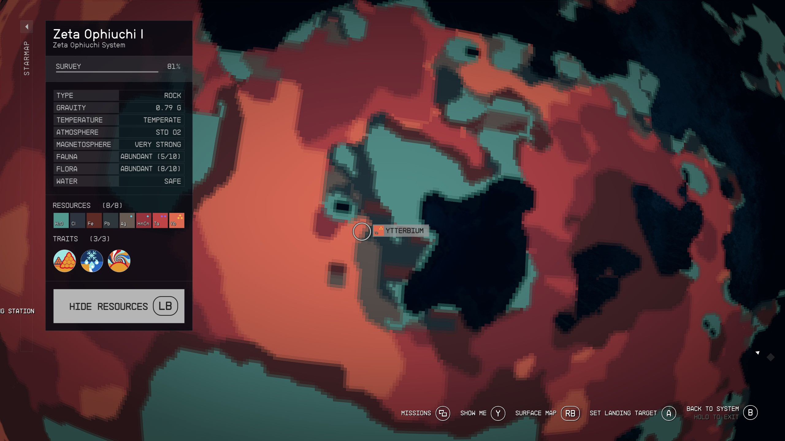

## Industry from Scratch

New Game, New You? Here's how to bootstrap your industry. Start off with a handful of Tungsten, building out basic resources and low tier manufactured goods:

- Bessel III-b for Al/Fe/Ni/Co
- Assembly line for Adaptive Frame and Isocentered Magnets
- Procyon III for copper
- Shoza III-a for beryllium, neodymium and helium-3
- Alpha Tirna VIII-c titanium and tungsten

From this you'll be able to construct most tier 1 manufactured goods. The process is entirely based on picking stuff up from each outpost and bringing it back to Bessel III-b for the moment, we'll start introducing cargo links and inter-system cargo links after Andraphon (or Leviathan II).

After that we'll proceed to producing Reactors as a stepping stone towards producing Advanced Reactors.

### Bessel III-b Al/Fe/Ni/Co

Start with Bessel III-b, basic extraction site. Produce Isocentered Magnet and Adaptive Frame from that material.

This site can be boot-strapped with 8 tungsten (bought from eg: Jemison Mercantile) by building the industrial workbench from gathered materials, then continuing to produce components (isocentered magnets for the turbines, adaptive frame for the storage) from harvested materials.

Be aware that one hour on Bessel III-b is a couple of days UT. One local day is 58 days UT.

Design:

- Industrial Workbench
- 4 Wind Turbine - Advanced (6 power)
- 4 Extractor - Solid (aluminum, cobalt, iron, nickel)
- 4 Storage - Solid - Large (aluminum, cobalt, iron, nickel)
- Landing Pad - Small

Materials:

- Adaptive Frame: 40
- Aluminum: 112
- Iron: 123
- Isocentered Magnet: 8
- Tungsten: 8

Location: See Brahmiluff, [Bessel III-b outpost location](https://www.youtube.com/watch?v=NSxSKiD4ahk), YouTube 23 Sep 2023

### Andraphon (He3/Be)

The only use for Europium is Microsecond Regulator, which we don't need to build if buying Aldumite Drilling Rig from vendors. Androphon can be useful as an extra Helium source.

- He3 for transport
- Beryllium for Bessel workshop
- Stock Europium

Solar Array: 6
Wind Turbine: 0

- Landing Pad - Small
- 3 Solar Dome (12 power)
- Extractor - Solid (beryllium)
- Storage - Solid - Large (beryllium)
- 4 Extractor - Gas (He3)
- Storage - Gas - Large (He3)

Bill of Materials:

- Adaptive Frame: 20
- Aluminum: 60
- Copper: 32
- Iron: 45
- Nickel: 16
- Tau Grade Rheostat: 6
- Tungsten: 18

Location:

It's worth pointing out that if you land right in a Europium rich area, He3 will be extremely rare. If you land in a He3 righ area, Europium will be extremely rare. These images show the location of a site with He3, Beryllium, Aluminium, Europium and Iron.

Video presentation of this site by JRamosWorks Gaming Fun, [#Starfield Outposts - 5 Resources in One Spot on Andraphon | Great Starter Locations Video 1 of 4](https://www.youtube.com/watch?v=XEJNLgBUXVI)

### Procyon III (Cu, Sealant)

[Procyon III](https://inara.cz/starfield/starsystem/101/#area1624) is one of several convenient sources of **Ionic Liquid**, along with Copper, Fluorine, Tetrafluoride, Water, Antimicrobial, Sealant, and Fiber. All the materials should be available if you select a site in a region rich with Ionic Liquids (bright green patches on the map).

We'll start off with extracting copper to drive industry at Bessel III-b.

Remember to wait for some copper production.

Design:

- Landing Pad - Small
- Industrial Workbench
- Wind Turbine - Advanced (25 power)
- Extractor - Solid (copper)
- 2 Storage - Solid - Large (copper, sealant)
- Extractor - Liquid (water)
- Storage - Liquid - Large (water)
- Greenhouse (sealant)

Bill of Materials:

- Manufactured
  - Adaptive Frame: 35
  - Isocentered Magnet: 2
  - Reactive Gauge: 3 (built on-site using copper extracted locally)
- Solid
  - Aluminum: 78 (+3 for reactive gauge)
  - Iron: 71
  - Nickel: 20
  - Sealant: 3
  - Tungsten: 2
- Gas
  - Fluorine: 4

You should be able to find an appropriate site in various wetlands (regions where Ionic Liquids are available). Look for a flat site with copper, ionic liquids, fluorine, and tetrafluorides. The ionic liquids and tetrafluorides will be needed later for producing isotopic coolant, while the fluorine is necessary for producing greenhouses.

### Alpha Tirna VIII-c (Dy, Pb, Ta, Ti, W, Alkanes)

Power and water are an issue on this planet. Solar Arrays will produce 6 power while Wind Turbines produce 3. Water is only available as vapour. The main minerals of interest here are Titanium for warehouses and Tungsten for extractors.

Design:

- 1 Landing Pad - Small
- 3 Solar Dome (12 power)
- 5 Extractor - Solid (dysprosium, lead, tantalum, titanium, tungsten)
- 5 Storage - Solid - Large (dysprosium, lead, tantalum, titanium, tungsten)
- 1 Extractor - Gas (alkanes)
- 1 Storage - Gas - Large (alkanes)

Materials:

- Manufactured
  - Adaptive Frame: 60
  - Tau Grade Rheostat: 6
- Solid
  - Aluminum: 125
  - Copper: 23
  - Iron: 145
  - Nickel: 4
  - Tungsten: 26

Location:

Check Brahmiluff's location from [8-in-one Resources Tirna VIII-c Outpost Location in Starfield!](https://www.youtube.com/watch?v=pCjAUcrqYGs). Here's the swamp site on the planet resource map with higher level Scanning skill: 

### Zeta Ophiucui I (silver, ytterbium, polymer)

Design:

- 2 Wind Turbine - Advanced (14 power)
- Landing Pad - Small
- Extractor - Solid (silver)
- Extractor - Solid (ytterbium)
- Storage - Solid - Large (silver)
- Storage - Solid - Large (ytterbium)
- Extractor - Liquid (water)
- Storage - Liquid - Large (water)
- Greenhouse (polymer)
- Storage - Solid - Large (polymer)

Bill of Materials:

- Manufactured
  - Adaptive Frame: 45
  - Isocentered Magnet: 4
  - Reactive Gauge: 3
- Solid
  - Aluminum: 99
  - Iron: 93
  - Nickel: 20
  - Sealant: 3
  - Tungsten: 4
- Gas
  - Fluorine: 4

Location:

Land on the swamp side of a swamp/mountains border. You should find that Ytterbium and Tantalum are *everywhere*. Find a site that has silver and ytterbium, typically the silver will be in small patches, but if you have that patch entirely within the outpost border you can squeeze five extractors onto it (later, during upgrades). It can be useful to have more resources but the important bit is having enough silver to provide industry.

### Shoza III-a (He3, Be, Nd)

Design:

- Landing Pad - Small
- 2 Solar Dome
- 3 Extractor - Solid (aluminum, beryllium, neodymium)
- 3 Storage - Solid - Large (aluminum, beryllium, neodymium)
- Extractor - Gas (he3)
- Storage - Gas - Large (he3)

Materials:

- Manufactured
  - Adaptive Frame: 40
  - Tau Grade Rheostat: 4
- Solid
  - Aluminum: 81
  - Copper: 23
  - Iron: 95
  - Nickel: 4
  - Tungsten: 22

Location:

There's a little circular patch of helium-rich terrain on the edge of a region of neodymium-rich terrain. I've had luck finding helium-3, beryllium and neodymium on Shoza III-a within a few minutes of setting down (and if I don't, just reload the pre-landing save and try a new spot). I won't win any speed runs, but it's not like Leviathan II where things are almost impossible to find.

### Serpentis IV (fiber, structural)

This outpost is where I build my pharmaceutical lab and kitchen. This initial setup will provide fiber and structural material to start building a habitat. A habitat here will be useful to house security detail to complement turrets and robots, all of which will be busy keeping clickbeetles at bay.

Design:

- 1 Landing Pad - Small
- 3 Wind Turbine - Advanced
- 2 Greenhouse (fiber, structural)
- 2 Extractor - Liquid (water)
- Storage - Liquid - Large (water)
- Extractor - Solid (lithium)
- 3 Storage - Solid - Large (fiber, lithium, structural)
- 2 Extractor - Gas (argon, benzene)
- 2 Storage - Gas - Medium (argon, benzene)

Materials:

- Manufactured
  - Adaptive Frame: 60
  - Isocentered Magnet: 6
  - Reactive Gauge: 6
- Solid
  - Aluminum: 115
  - Copper: 26
  - Iron: 91
  - Nickel: 32
  - Sealant: 6
  - Tungsten: 18
- Gas
  - Fluorine: 8

### Gagarin (adhesive)

This outpost isn't strictly necessary, you can buy adhesive and lead in the quantities needed when heading off to build outposts. For completeness, here it is.

Design:

- Landing Pad - Small
- Wind Turbine - Advanced
- Extractor - Liquid (water)
- Greenhouse (adhesive)
- Storage - Solid (adhesive)

Materials:

- Manufactured
  - Adaptive Frame: 8
  - Isocentered Magnet: 2
  - Reactive Gauge: 3
- Solid
  - Aluminum: 23
  - Iron: 29
  - Nickel: 4
  - Sealant: 3
- Gas
  - Fluorine: 4

### Home Base Industry Expansion

With the titanium available from Tirna VIII-c, build some extra storage (home base for me is typcially Serpentis IV):

Design:

- 4 Wind Turbine - Advanced (6 power)
- 9 Storage - Solid - Large (beryllium, copper, dysprosium, europium, neodymium, silver, titanium, tungsten, ytterbium)
- 2 Storage - Gas - Large (alkanes, fluorine)
- 5 Warehouse - Large (adaptive frame, isocentered magnet, isotopic coolant, mag pressure tank, reactive gauge, zero wire)
- 4 Simple Fabricator (adaptive frame, isocentered magnet, mag pressure tank, reactive gauge, zero wire)

Bill of Materials:

- Manufactured
  - Adaptive Frame: 130
  - Isocentered Magnet: 8
  - Zero Wire: 12
- Solid
  - Aluminum: 276
  - Iron: 180
  - Sealant: 8
  - Titanium: 64
  - Tungsten: 16

Import beryllium from Shoza III-a, copper from Procyon III, silver & ytterbium from Zeta Ophiuchi I, alkanes/dysprosium/titanium/tungsten from Alpha Tirna III-c.

Note: if you have the inclination try out this storage arrangement which will adequately serve all your boutique crafting needs. Not shown here is the array of warehouses and fabricators.

