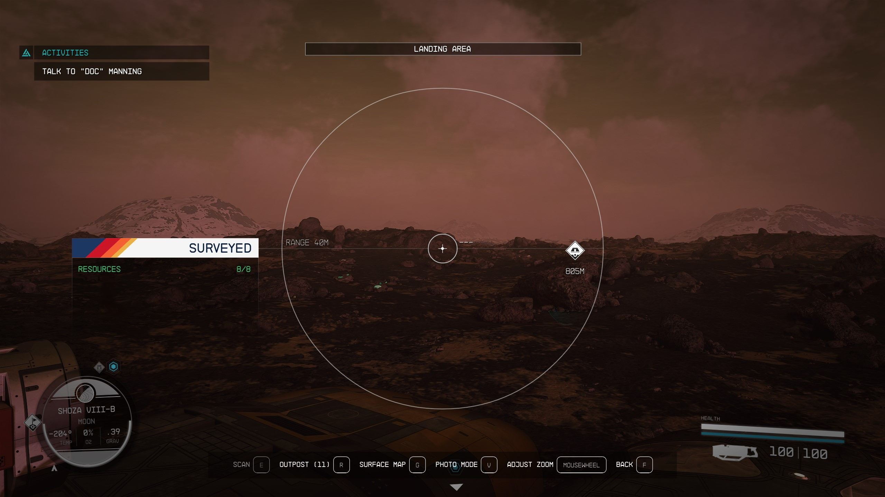
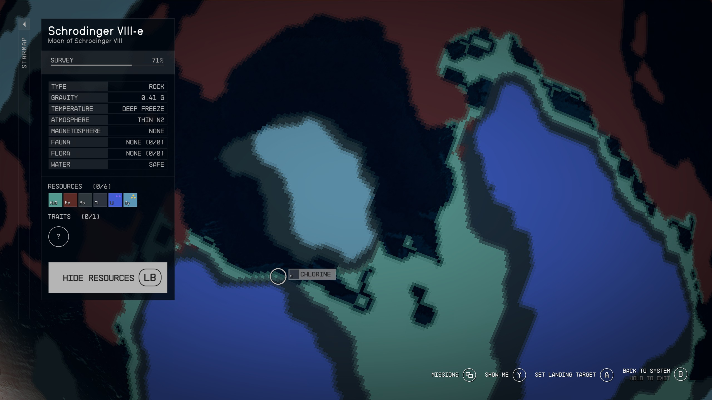
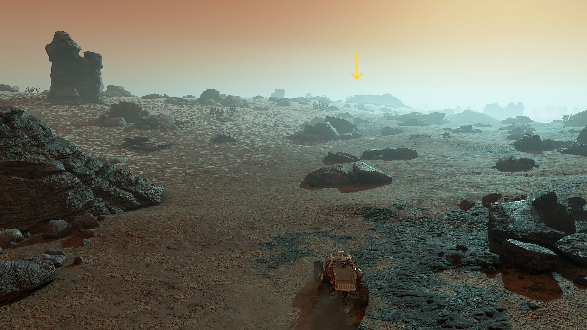

# Starfield Resource Extraction

- [Starfield Resource Extraction](#starfield-resource-extraction)
  - [Miscellany](#miscellany)
    - [Nice Outpost Starter](#nice-outpost-starter)
    - [Containers](#containers)
    - [Measured Components for Cargo Link - Inter-system](#measured-components-for-cargo-link---inter-system)
    - [Estimating Structures Required for Production Rates](#estimating-structures-required-for-production-rates)
      - [Worked example: Greenhouse producing fiber](#worked-example-greenhouse-producing-fiber)
      - [Worked Example: Animal Husbandry Facility producing membrane](#worked-example-animal-husbandry-facility-producing-membrane)
      - [Worked Example: Lithium Extractors](#worked-example-lithium-extractors)
    - [Storage Requirements](#storage-requirements)
  - [Industry from Scratch](#industry-from-scratch)
    - [Bessel III-b Al/Fe/Ni/Co](#bessel-iii-b-alfenico)
    - [Procyon III (Cu)](#procyon-iii-cu)
    - [Alpha Tirna VIII-c (Dy, Ta, Ti, W, Alkanes)](#alpha-tirna-viii-c-dy-ta-ti-w-alkanes)
    - [Bessel III-b Industry Expansion](#bessel-iii-b-industry-expansion)
    - [Leviathan II (He3/Be/Eu/Nd)](#leviathan-ii-he3beeund)
    - [Leviathan II (He3 Expansion)](#leviathan-ii-he3-expansion)
  - [Reactor Production](#reactor-production)
      - [Procyon III (Isotopic Coolant/Antimicrobial expansion)](#procyon-iii-isotopic-coolantantimicrobial-expansion)
    - [Cruth (Semimetal Wafer, Paramagnon Conductor)](#cruth-semimetal-wafer-paramagnon-conductor)
    - [Grimsey (Iridium, Plutonium, Uranium, Vanadium)](#grimsey-iridium-plutonium-uranium-vanadium)
    - [Codos (Solvent)](#codos-solvent)
    - [Zeta Ophiucui I (silver, ytterbium, polymer)](#zeta-ophiucui-i-silver-ytterbium-polymer)
    - [Operation](#operation)
  - [Industrial Liquid Extractors and Greenhouses](#industrial-liquid-extractors-and-greenhouses)
    - [Molecular Sieve](#molecular-sieve)
      - [Bessel III-b (Austenitic Manifold, Mag Pressure Tank)](#bessel-iii-b-austenitic-manifold-mag-pressure-tank)
      - [Serpentis IV (membrane, molecular sieve)](#serpentis-iv-membrane-molecular-sieve)
    - [Sterile Nanotubes](#sterile-nanotubes)
      - [Serpentis IV (sterile nanotubes)](#serpentis-iv-sterile-nanotubes)
    - [Substrate Molecule Sieve](#substrate-molecule-sieve)
    - [Alpha Andraste III (biosuppressant)](#alpha-andraste-iii-biosuppressant)
      - [Serpentis IV (fibre and water expansion)](#serpentis-iv-fibre-and-water-expansion)
      - [Fermi VII-a (Memory Substrate)](#fermi-vii-a-memory-substrate)
      - [Serpentis IV (substrate molecule sieve)](#serpentis-iv-substrate-molecule-sieve)
    - [Veryl-Treated Manifold](#veryl-treated-manifold)
      - [Verne I (neon, veryl)](#verne-i-neon-veryl)
      - [Alpha Tirna VIII-c (Lubricant expansion)](#alpha-tirna-viii-c-lubricant-expansion)
      - [Serpentis IV (veryl-treated manifold)](#serpentis-iv-veryl-treated-manifold)
  - [Industrial Solid Extractors](#industrial-solid-extractors)
    - [Schrodinger II (aldumite)](#schrodinger-ii-aldumite)
  - [Advanced Reactor Production](#advanced-reactor-production)
    - [Operation](#operation-1)
    - [Experience grinding](#experience-grinding)
    - [Shoza VIII-b (Positron Battery, Power Circuit)](#shoza-viii-b-positron-battery-power-circuit)
    - [Katydid III (Indicite, Silver)](#katydid-iii-indicite-silver)
    - [Zeta Ophiuchi I (silver exports)](#zeta-ophiuchi-i-silver-exports)
    - [Cruth (cargo link expansion)](#cruth-cargo-link-expansion)
    - [Codos (solvent to grimsey)](#codos-solvent-to-grimsey)
    - [Dalvik (Caesium)](#dalvik-caesium)
    - [Decaran VII-b (Vytinium)](#decaran-vii-b-vytinium)
    - [Grimsey (Vytinium Fuel Rod expansion)](#grimsey-vytinium-fuel-rod-expansion)
    - [Procyon III Expansion (Isotopic Coolant, Copper to Bessel III-b)](#procyon-iii-expansion-isotopic-coolant-copper-to-bessel-iii-b)
    - [Bessel III-b Expansion (manufacturing, cargo links)](#bessel-iii-b-expansion-manufacturing-cargo-links)
    - [Carinae III-a (Rothicite)](#carinae-iii-a-rothicite)
    - [Zeta Ophiuchi I (Polymer, Silver, Ytterbium)](#zeta-ophiuchi-i-polymer-silver-ytterbium)
    - [Huygens VII-a (Tasine)](#huygens-vii-a-tasine)
    - [Serpentis V-d (He3/SupColMag)](#serpentis-v-d-he3supcolmag)
    - [Shoza III-a (He3 expansion)](#shoza-iii-a-he3-expansion)
    - [Shoza VIII-b (inter-system links)](#shoza-viii-b-inter-system-links)
    - [Schrodinger VIII-e (C-Rods, R-Mags, u-sec Regs, Dy, Li, Pb)](#schrodinger-viii-e-c-rods-r-mags-u-sec-regs-dy-li-pb)
    - [Industrial Upgrades](#industrial-upgrades)
      - [Cruth (Mass Production of Semimetal Wafers)](#cruth-mass-production-of-semimetal-wafers)
  - [Other Sites](#other-sites)
    - [Andraphon (He3/Be) - Outdated](#andraphon-he3be---outdated)
  - [References](#references)

## Miscellany

Some things to mention before we get into the body of this guide.

### Nice Outpost Starter

Here's a standard habitat I like to install just for the RP flavour.

- Four Wall Hab - Double
- Hab Round
- Hydroponic Hab Round
- Outpost Airlock
- 3 Crew Station
- 3 Bed 10
- Landing Pad - Small

Materials:

- Aluminium: 82 (41kg) small storage
- Iron: 41 (25kg) small storage
- Nickel: 27 (17kg) small storage
- Lead: 20 (14kg) 2 storage box
- Sealant: 16 (8kg) 2 storage box
- Fiber: 36 (18kg) 2 storage box
- Structural: 48 (25kg) 3 storage box

When positioning the Four Wall Hab - Double, make sure to use the trapezoid on top as an arrow to point to where the view is, the short side of that trapezoid marks the side where the stairs meet the top storey. Then join the round habs on to that side of the Four Wall Hab - Double. Now add the airlock where it will fit on the Four Wall Hab - Double.

### Containers

Containers that can be included in storage chains:

- Storage Box (10kg) (2,3)
- Warehouse (60kg)
- Storage Crate (157kg) (2)
- Warehouse - Medium (157kg)
- Warehouse - Large (300kg)

When crafting at a workbench you can not pull resources from the storage boxes or storage crates, only the Storage and Warehouse components (along with personal inventory and home ship inventory if it is within 250m).

### Measured Components for Cargo Link - Inter-system

- 12 Aluminium (6kg) Storage Box
- 1 Comm Relay (3.5kg) Storage Box
- 20 Iron (12kg) 2 Storage Box
- 3 Reactive Gauge (4.5kg) Storage Box

Put those storage boxes on a table, link them into the production chain to receive the materials, then any time you want to build inter-system cargo links just grab the contents of those boxes and you're set!

### Estimating Structures Required for Production Rates

Each producer structure has a certain rate of production, and those that take inputs will have their own rate of consumption. As an example, extractors will vary the quantity produced and the time between outputs based on character skills, material being extracted, and extractor tier.

To estimate the structures required to meet certain production rates, first measure the actual production:

1. Build the required power supply including a Powered Switch
2. Wire the power supply to the Powered Switch and turn it off
3. Build the required storage for inputs and outputs
4. Build a producer with any required input and output storage connected
5. Supply the appropriate inputs (just fill up the input storage)
6. Start a 10 minute timer
7. Switch the Powered Switch on
8. When the timer expires, turn the switch back off

Now you have an estimate of ten hours of production and consumption (1 minute real time is 1 hour UT in-game). Note that a more accurate method would be to use a stopwatch and record "lap times" as each batch of material is produced, but this requires watching the screen for ten minutes whie doing nothing else. I'm lazy so I go for the units produced in a fixed period of time, rather than the time between produciton of units.

NB: **you can not do anything else during the sample interval**. Checking character screen, inventory, switching to other programs or even letting your computer sleep will all interrupt the production chain. Just be near the computer and waggle the mouse or wobble the controller stick every now and then to keep the computer awake and the game running.

#### Worked example: Greenhouse producing fiber

Design:

- Wind Turbine
- Greenhouse
- Storage - Liquid - Large (water)
- Storage - Solid - Large (fiber)
- Powered Switch

Materials:

- Adaptive Frame: 25
- Aluminum: 43
- Cobalt: 2
- Copper: 2
- Fluorine: 4
- Iron: 20
- Nickel: 19
- Reactive Gauge: 3
- Sealant: 3

Connect these as Liquid storage -> Greenhouse -> Solid Storage, then wire the turbine to the powered switch and wire the powered switch to the greenhouse.

Storage state:

- 59 water
- 0 fiber

Start the 10 minute timer, turn the power on.

At 10 minutes turn the power off.

Storage state:

- 42 water (- 17 water)
- 17 fiber (+ 17 fiber)

This works out to roughly 1.7 fiber per minute, or  1 fiber every 35 seconds, with a 1:1 conversion rate from water to fiber. As your production rate increases, the game reduces the time between each batch of production.

In other experiments I have determined that **water extractors** produce the following amounts in 10 minutes real time:

- Extractor: 18
- Commercial: 42
- Industrial: 68

So for a base level greenhouse, slightly more than one water extractor per greenhouse is sufficient water supply.

*These figures will all change as you add robots and crew, so make sure you perform the tests every time you change robot or crew assignments*.

#### Worked Example: Animal Husbandry Facility producing membrane

This experiment took place on Serpentis IV.

Design:

- Wind Turbine (25 power)
- Storage - Liquid - Large (water)
- 2 Storage - Solid - Large (fiber, membrane)
- Animal Husbandry Facility (membrane)
- Powered Switch

Materials:

- Manufactured
  - Adaptive Frame: 35
  - Reactive Gauge: 3
- Solid
  - Aluminum: 67
  - Cobalt: 2
  - Copper: 2
  - Iron: 40
  - Nickel: 19
  - Sealant: 3

Method:

- Build the components (animal husbandry facility, liquid storage for water, solid storage for fiber, solid storage for membrane, powered switch, wind turbine)
- Hook up water and fibre to animal husbandry facility
- Hook up animal husbandry facility to empty storage for membrane
- Wire powered switch to animal husbandry facility
- Wire the wind turbine to the powered switch
- Ensure the powered switch is off (no power to the production facility)
- Fill the input containers with water and fibre respectively
- Empty the output container
- Records the quantities of materials in each container
- Start a 10 minute timer and turn the powered switch on
- At the expiry of the 10 minute timer, turn the powered switch off
- Record the quantities of materials in each container

Results:

- Start
	- 600 water
	- 594 fiber
	- 0 membrane
- End
	- 590 water
	- 574 fiber
	- 10 membrane

Conclusion:

The Animal Husbandry Facility consumes 1 water, 2 fibre each minute to produce 1 membrane.

Based on previous results with water extractors, 1 water extractor is almost enough to provide water for 2 animal husbandry facilities (18 produced vs 10 consumed over the 10h game time), but each AHF requires more than 1 greenhouse producing fiber (17 produced vs 20 consumed).

#### Worked Example: Lithium Extractors

This experiment took place on Serpentis IV.

Design:

- 2 Reactor
- 1 Extractor - Solid
- 1 Extractor - Solid - Commercial
- 1 Extractor - Solid - Industrial
- Powered Switch
- 3 Storage - Solid

Materials:

- Manufactured
  - Adaptive Frame: 29
  - Aldumite Drilling Rig: 1
  - Control Rod: 6
  - Drilling Rig: 1
  - Isotopic Coolant: 6
  - Nuclear Fuel Rod: 16
  - Paramagnon Conductor: 8
  - Supercooled Magnet: 10
  - Tau Grade Rheostat: 6
- Solid
  - Aluminum: 21
  - Copper: 2
  - Iron: 23
  - Lead: 20
  - Tungsten: 12

Method:

- Build the components
- Wire the reactors to the switch and the switch to the extractors
- Turn the switch off
- Connect the extractors to their own storages
- Empty the storage and extractors
- Start a 10 minute timer and switch the power on
- At the conclusion of the timer, turn the power off
- Record the volume of lithium produced
 
Result:

- Standard: 18
- Commercial: 22
- Industrial: 36

### Storage Requirements

Mineral Solids (small/medium unless otherwise specified, 30):

- Aldumite
- Aluminum (large)
- Antimony
- Aqueous Hematite
- Beryllium
- Caelumite
- Cobalt
- Copper (large)
- Dysprosium
- Europium
- Gold
- Indicite
- Iridium
- Iron (large)
- Lead
- Lithium
- Neodymium
- Nickel
- Palladium
- Platinum
- Plutonium
- Rothicite
- Silver
- Tantalum
- Titanium
- Tungsten
- Uranium
- Vanadium
- Vytinium
- Ytterbium

Organic Solids (31):

- Adhesive
- Amino Acids
- Analgesic
- Antimicrobial
- Aromatic
- Biosuppressant
- Cosmetic
- Fiber
- Gastronomic Delight
- Hallucinogen
- High-Tensile Spidroin
- Hypercatalyst
- Immunostimulant
- Lubricant
- Luxury Textile
- Membrane
- Memory Substrate
- Metabolic Agent
- Neurologic
- Nutrient
- Ornamental Material
- Pigment
- Polymer
- Quark-Degenerate Tissues
- Sealant
- Sedative
- Solvent
- Spice
- Stimulant
- Structural Material
- Toxin

Liquids (7):

- Caesium
- Carboxylic Acids
- Chlorosilanes
- Ionic Liquids
- Mercury
- Tasine
- Water

Gasses (10):

- Alkanes
- Argon
- Benzene
- Chlorine
- Fluorine
- Neon
- Tetrafluorides
- Veryl
- Xenon

Warehouses (small unless indicated otherwise):

- Adaptive Frame (large)
- Aldumite Drilling Rig
- Austenitic Manifold
- Comm Relay
- Control Rod
- Drilling Rig
- Indicite Wafer
- Isocentered Magnet
- Isotopic Coolant
- Mag Pressure Tank
- Microsecond Regulator
- Molecular Sieve
- Monopropellant
- Nuclear Fuel Rod
- Paramagnon Conductor
- Polytextile
- Positron Battery
- Power Circuit
- Reactive Gauge
- Rothicite Magnet
- Semimetal Wafer
- Sterile Nanotubes
- Substrate Molecule Sieve
- Supercooled Magnet
- Tasine Superconductor
- Tau Grade Rheostat
- Veryl-Treated Manifold
- Zero Wire
- Zero-G Gimbal

## Industry from Scratch

New Game, New You? Here's how to bootstrap your industry. Start off with a handful of Tungsten, building out basic resources and low tier manufactured goods:

- Bessel III-b for Al/Fe/Ni/Co
- Assembly line for Adaptive Frame and Isocentered Magnets
- Procyon III for copper
- Leviathan II for beryllium and helium-3
- Alpha Tirna VIII-c titanium and tungsten

From this you'll be able to construct most tier 1 manufactured goods. The process is entirely based on picking stuff up from each outpost and bringing it back to Bessel III-b for the moment, we'll start introducing cargo links and inter-system cargo links after Andraphon (or Leviathan II).

After that we'll proceed to producing Reactors as a stepping stone towards producing Advanced Reactors.

### Bessel III-b Al/Fe/Ni/Co

Start with Bessel III-b, basic extraction site. Produce Isocentered Magnet and Adaptive Frame from that material.

This site can be boot-strapped with 8 tungsten (bought from eg: Jemison Mercantile) by building the industrial workbench from gathered materials, then continuing to produce components (isocentered magnets for the turbines, adaptive frame for the storage) from harvested materials.

Be aware that one hour on Bessel III-b is a couple of days UT. One local day is 58 days UT.

Design:

- Industrial Workbench
- 4 Wind Turbine - Advanced (6 power)
- 4 Extractor - Solid (aluminum, cobalt, iron, nickel)
- 4 Storage - Solid - Large (aluminum, cobalt, iron, nickel)
- Landing Pad - Small

Materials:

- Adaptive Frame: 40
- Aluminum: 112
- Iron: 123
- Isocentered Magnet: 8
- Tungsten: 8

Location: Brahmiluff, [Bessel III-b outpost location](https://www.youtube.com/watch?v=NSxSKiD4ahk), YouTube 23 Sep 2023

### Procyon III (Cu)

[Procyon III](https://inara.cz/starfield/starsystem/101/#area1624) is one of several convenient sources of **Ionic Liquid**, along with Copper, Fluorine, Tetrafluoride, Water, Antimicrobial, Sealant, and Fiber. All the materials should be available if you select a site in a region rich with Ionic Liquids (bright green patches on the map).

We'll start off with extracting copper to drive industry at Bessel III-b.

Design:

- Landing Pad - Small
- Wind Turbine - Advanced (25 power)
- Extractor - Solid (Cu)
- Storage - Solid - Large (Cu)

Bill of Materials:

- Adaptive Frame: 10
- Aluminum: 33
- Iron: 45
- Isocentered Magnet: 2
- Tungsten: 2

You should be able to find an appropriate site in various wetlands (regions where Ionic Liquids are available). Look for a flat site with copper, ionic liquids, fluorine, and tetrafluorides. The ionic liquids and tetrafluorides will be needed later for producing isotopic coolant, while the fluorine is necessary for producing greenhouses.

### Alpha Tirna VIII-c (Dy, Ta, Ti, W, Alkanes)

Power and water are an issue on this planet. Solar Arrays will produce 6 power while Wind Turbines produce 3. Water is only available as vapour. The main mineral of interest here are Titanium for warehouses and Tungsten for extractors.

Design:

- 1 Landing Pad - Small
- 3 Solar Dome (12 power)
- 4 Extractor - Solid (dysprosium, tantalum, titanium, tungsten)
- 4 Storage - Solid - Large (dysprosium, tantalum, titanium, tungsten)
- 1 Extractor - Gas (alkanes)
- 1 Storage - Gas - Large (alkanes)

Materials:

- Manufactured
  - Adaptive Frame: 50
  - Tau Grade Rheostat: 6
- Solid
  - Aluminum: 105
  - Copper: 23
  - Iron: 120
  - Nickel: 4
  - Tungsten: 24

Location:

### Bessel III-b Industry Expansion

With the titanium available from Tirna VIII-c, build some extra storage:

Design:

- 4 Wind Turbine - Advanced (6 power)
- 2 Storage - Solid - Large (copper, silver)
- 4 Warehouse - Large (adaptive frame, isocentered magnet, mag pressure tank, reactive gauge, zero wire)
- 4 Simple Fabricator (adaptive frame, isocentered magnet, mag pressure tank, reactive gauge, zero wire)

Bill of Materials:

- Adaptive Frame: 50
- Aluminum: 116
- Iron: 40
- Titanium: 48
- Sealant: 6
- Tungsten: 12
- Zero Wire: 9

Copper will be imported from Procyon III, silver will be imported from Zeta Ophiuchi I.

### Leviathan II (He3/Be/Eu/Nd)

Design:

- Landing Pad - Small
- 4 Solar Dome (16 power)
- Extractor - Solid (beryllium)
- Storage - Solid - Large (beryllium)
- Extractor - Solid (europium)
- Storage - Solid - Large (europium)
- Extractor - Solid (neodymium)
- Storage - Solid - Large (neodymium)
- 8 Extractor - Gas (He3)
- Storage - Gas - Large (He3)
- Cargo Link - Inter-system (He3 to Bessel III-b)
- Cargo Link - Inter-system (He3 to Grimsey)

Bill of Materials:

- Adaptive Frame: 40
- Aluminum: 148
- Comm Relay: 2
- Copper: 44
- Iron: 135
- Nickel: 32
- Reactive Gauge: 6
- Tau Grade Rheostat: 8
- Tungsten: 22

Location:

It's possible to find a location here with Al/Be/Eu/He3/Nd, but it feels like the "Craters" biome on Leviathan II is actually three separate biomes of Craters with beryllium, Craters with aluminium and He3, and Craters with neodymium/europium. They do mix but generally speaking He3 is harder to find where Europium is easier to find and vice versa. I don't know if it's just confirmation bias but it seems to me that some terrain is slighly shinier and paler than the neighbouring terrain and that's the biome with Europium and Neodymium. YMMV.

### Leviathan II (He3 Expansion)

As supplies become available, upgrade He3 extractors to Industrial where constrained He3 supply is causing extraction chains to fill up (where the cargo link is unable to deliver materials before all the storage fills up). Increase helium supply only if the production sites are regularly backing up with more than two days worth of production.

Part of the Industrial Liquid Extractors project is producing the Substrate Molecule Sieve required for industrial gas extractors. Each industrial extractor upgrade will require:

- Extractor - Helium-3 - Industrial (20 power)
- 2 Solar Dome (12 power)

Eventually replace those solar domes with an Advanced Reactor. I could squeeze 7 industrial He3 extractors on the tiny helium patch at this site.

## Reactor Production

As a stepping stone to the Advanced Reactor Production chain, having the capacity to build normal reactors is useful. They produce a fixed 30 power which is great for those worlds where wind turbines and solar arrays are especially weak. This manufacturing system will not use cargo links since the volume of production is so low.

Recipe for Reactors:

- Adaptive Frame: 6
- Control Rod: 3
  - Austenitic Manifold: 1
  - Dysprosium: 3
  - Isotopic Coolant: 1
- Lead: 10
- Nuclear Fuel Rod: 8
  - Semimetal Wafer: 1
  - Solvent: 2
  - Uranium: 3
- Paramagnon Conductor: 4
  - Gold: 1
  - Neodymium: 1
  - Zero Wire: 3
- Supercooled Magnet: 5
  - Isocentered Magnet: 1
  - Isotopic Coolant: 1
  - Neodymium: 3
- Tau Grade Rheostat: 3

#### Procyon III (Isotopic Coolant/Antimicrobial expansion)

Upgading the copper-producing infrastructure at Procyon III to produce Isotopic Coolant and Antimicrobial.

Design:

- 2 Wind Turbine - Advanced (25 power)
- 2 Extractor - Gas (fluorine, tetrafluoride)
- 2 Storage - Gas - Large (fluorine, tetrafluoride)
- 3 Extractor - Liquid (Ionic Liquid, 2 water)
- 2 Storage - Liquid - Large (ionic liquid, water)
- 2 Greenhouse (antimicrobial, sealant)
- 3 Storage - Solid - Large (copper, antimicrobial, sealant)
- Simple Fabricator (Isotopic Coolant)
- Warehouse - Large (Isotopic Coolant)
- Cargo Link - Inter-system (isotopic coolant to Schrodinger VIII-e)
- Cargo Link - Inter-system (isotopic coolant to Serpentis V-d)

Bill of Materials:

- Adaptive Frame: 90
- Aluminum: 175
- Comm Relay: 2
- Copper: 46
- Fluorine: 8
- Iron: 109
- Isocentered Magnet: 4
- Nickel: 52
- Reactive Gauge: 12
- Sealant: 8
- Titanium: 16
- Tungsten: 36
- Zero Wire: 3

### Cruth (Semimetal Wafer, Paramagnon Conductor)

During start-up, import silver manually from Zeta Ophiuchi I.

Design:

- Landing Pad - Small
- 9 Solar Dome (4 power)
- 3 Extractor - Solid (gold, antimony, copper)
- 5 Storage - Solid - Large (gold, antimony, neodymium, copper, silver)
- Simple Fabricator (zero wire)
- 3 Warehouse - Large (zero wire, semimetal wafers, paramagnon conductor)
- 2 Compound Fabricator (semimetal wafer, paramagnon conductor)

Materials:

- Adaptive Frame: 80
- Adhesive: 8
- Aluminum: 204
- Iron: 135
- Isotopic Coolant: 4
- Sealant: 2
- Tau Grade Rheostat: 18
- Titanium: 48
- Tungsten: 26
- Zero Wire: 13

Location:

Location of Cruth outpost isn't important, just plonk it down on a large yellow patch (Gold, Antimony, Copper). All the resources this outpost needs are in a single biome.

### Grimsey (Iridium, Plutonium, Uranium, Vanadium)

For the moment, use Grimsey as a depot for materials to build reactors. This will change when the advanced reactor production chain is set up.

Design:

- Landing Pad - Small
- Industrial Workbench
- 4 Solar Dome (6 power)
- 4 Extractor - Solid (iridium, plutonium, uranium, vanadium)
- 6 Storage - Solid - Large (lead, solvent, iridium, plutonium, uranium, vanadium)
- 3 Warehouse - Large (control rod, paramagnon conductor, semimetal wafer)

Materials:

- Adaptive Frame: 90
- Aluminum: 192
- Iron: 143
- Tau Grade Rheostat: 8
- Titanium: 48
- Tungsten: 8

### Codos (Solvent)

[Codos](https://inara.cz/starfield/starsystem/10/#area1158) is a nice place for a **solvent**-producing outpost, being the only domesticable plant-based solvent supply.

Design:

- Landing Pad - Small
- Wind Turbine - Advanced (14 power)
- Extractor - Liquid (water)
- Storage - Liquid - Large (water)
- Greenhouse (solvent)
- Storage - Solid - Large (solvent)

Materials:

- Adaptive Frame: 25
- Aluminum: 54
- Fluorine: 4
- Iron: 43
- Isocentered Magnet: 2
- Nickel: 20
- Reactive Gauge: 3
- Sealant: 3

### Zeta Ophiucui I (silver, ytterbium, polymer)

Design:

- 2 Wind Turbine - Advanced (14 power)
- Landing Pad - Small
- Extractor - Solid (silver)
- Extractor - Solid (ytterbium)
- Storage - Solid - Large (silver)
- Storage - Solid - Large (ytterbium)
- Extractor - Liquid (water)
- Storage - Liquid - Large (water)
- Greenhouse (polymer)
- Storage - Solid - Large (polymer)

Bill of Materials:

- Adaptive Frame: 45
- Aluminum: 99
- Fluorine: 4
- Iron: 93
- Isocentered Magnet: 4
- Nickel: 20
- Reactive Gauge: 3
- Sealant: 3
- Tungsten: 4

Location:

Land on the swamp side of a swamp/mountains border. You should find that Ytterbium and Tantalum are *everywhere*. Find a site that has silver and ytterbium, typically the silver will be in small patches, but if you have that patch entirely within the outpost border you can squeeze five extractors onto it (later, during upgrades). It can be useful to have more resources but the important bit is having enough silver to provide industry.

### Operation

Run a route to pick up materials and manufacture components on the way:

- Collect Neodymium from Leviathan II
- Collect Dysprosium, Lead from Alpha Tirna VIII-c
- Collect Isotopic Coolant from Procyon III
- Deliver Isotopic Coolant, Dysprosium, (half of the) Neodymium to Bessel III-b
- Craft 3 Control Rods
- Craft 5 Supercooled Magnet
- Collect 6 Adaptive Frame, 3 Tau Grade Rheostat from Bessel III-b
- Collect Silver from Zeta Ophiuchi I
- Deliver Silver, Neodymium to Cruth
- Collect 8 Semimetal Wafer (3.5kg, 3 x Storage Box), 4 Paramagnon Conductor (4kg, 2 x Storage Box) from Cruth
- Collect 8 Solvent from Codos
- Head to Grimsey to craft 8 Nuclear Fuel Rods
- Head to site to build reactor

## Industrial Liquid Extractors and Greenhouses

The larger project ahead is producing advanced reactors. For that project it would be nice to have better extraction technology. This immediate project is oriented towards producing Veryl-Treated Manifold and Substrate Molecule Sieve. These components allow construction of industrial liquid and gas extractors, and industrial greenhouses. These will be useful for materials such as Solvent.

Note that for the quantities required in any playthrough it might be easier just buying the Substrate Molecule Sieve and Veryl-Treated Manifold from the stores that stock them. Setting up the outposts to collect the unique resources is extra labour.

Stores that sometimes stock rarer parts:

- Clint's, Gagarin Landing
- Outland, New Atlantis
- UC Exchange, Cydonia
- Sieghart's, Neon
- Shepherd's, Akila City
- The Trader

Materials for Liquid Extractor - Industrial:

- 5 Adaptive Frame (1.6kg)
- 2 Substrate Molecule Sieve (4.5kg)
  - Biosuppressant
  - Memory Substrate
  - Molecular Sieve
  - Sterile Nanotube
- 6 Titanium (0.5kg)
- 3 Veryl-Treated Manifold (5.4kg)
  - Austenitic Manifold
  - Lubricant
  - 2 Veryl
  - Ytterbium

### Molecular Sieve

Molecular Sieve requires the following components:

- 2 Ionic Liquid
- 1 Mag Pressure Tank
  - 2 Aluminium
  - 1 Nickel
- 2 Membrane

#### Bessel III-b (Austenitic Manifold, Mag Pressure Tank)

Design:

- Reactor
- 2 Simple Fabricator (Austenitic Manifold, Mag Pressure Tank)
- 2 Warehouse - Large (Austenitic Manifold, Mag Pressure Tank)

Materials:

- Adaptive Frame: 16
- Aluminum: 28
- Control Rod: 3
- Lead: 10
- Nuclear Fuel Rod: 8
- Paramagnon Conductor: 4
- Sealant: 2
- Supercooled Magnet: 5
- Tau Grade Rheostat: 3
- Titanium: 16
- Tungsten: 4
- Zero Wire: 3

#### Serpentis IV (membrane, molecular sieve)

[Serpentis IV](https://inara.cz/starfield/starsystem/47/#area1892) has a domesticable animal that produces **Membrane**. Water is available locally. This base can be expanded over time to produce water, fiber, metabolic agent, sealant, toxin, analgesic, argon, lithium. In most playthroughs I'll end up building a pharamceutical lab here.

Design:

- 1 Landing Pad - Small
- 3 Wind Turbine - Advanced (25 power)
- 3 Greenhouse (fiber)
- 5 Extractor - Liquid (water)
- 1 Storage - Liquid - Large (water)
- 2 Extractor - Gas (argon, benzene)
- 2 Storage - Gas - Medium (argon, benzene)
- Extractor - Solid (lithium)
- 2 Animal Husbandry Facility (membrane, sealant)
- 5 Storage - Solid - Large (2 fiber, lithium, membrane, sealant)
- Storage - Liquid - Large (ionic liquids)
- Compound Fabricator (molecular sieve)
- 2 Warehouse - Small (mag pressure tank, molecular sieve)

Materials:

- Manufactured
  - Adaptive Frame: 111
  - Isocentered Magnet: 6
  - Isotopic Coolant: 2
  - Reactive Gauge: 15
  - Zero Wire: 5
- Solid
  - Adhesive: 4
  - Aluminum: 210
  - Copper: 26
  - Iron: 140
  - Nickel: 60
  - Sealant: 15
  - Titanium: 10
  - Tungsten: 26
- Gas
  - Fluorine: 12

Location:

### Sterile Nanotubes

To produce Sterile Nanotubes we need:

- 1 Molecular Sieve
- 2 Solvent
- 2 Vanadium

#### Serpentis IV (sterile nanotubes)

Import solvent from Codos, Vanadium from Grimsey.

Design:

- Wind Turbine - Advanced (25 power)
- 2 Storage - Solid - Large (solvent, vanadium)
- Compound Fabricator (sterile nanotubes)
- Warehouse - small (sterile nanotubes)

Materials:

- Manufactured
  - Adaptive Frame: 20
  - Isocentered Magnet: 2
  - Isotopic Coolant: 2
  - Zero Wire: 5
- Solid
  - Adhesive: 4
  - Aluminum: 37
  - Iron: 40
  - Tungsten: 8

### Substrate Molecule Sieve

These are needed for industrial water extractors and industrial greenhouses.

- 2 Biosuppressant
- 3 Memory Substrate
- 1 Molecular Sieve
- 2 Sterile Nanotubes

### Alpha Andraste III (biosuppressant)

[Alpha Andraste III](https://inara.cz/starfield/starsystem/25/#area1284) has a domesticable source of **Biosuppressant**.

Biosuppressant is used for a few mods, Substrate Molecule Sieve and Repairing Immobiliser. Over the entire course of the game you'll likely use a hundred or so, this is another outpost where you can happily fill up the storage, collect one full load and then remove the outpost.

Design:

- Landing Pad - Small
- Wind Turbine - Advanced (25 power)
- 2 Extractor - Liquid (water, chlorosilanes)
- 2 Storage - Liquid - Medium (water, chlorosilanes)
- Greenhouse (biosuppressant)
- Storage - Solid - Large (biosuppressant)
- 2 Extractor - Gas (xenon, chlorine)
- 2 Storage - Gas - Medium (xenon, chlorine)

Materials:

- Manufactured
  - Adaptive Frame: 35
  - Isocentered Magnet: 2
  - Reactive Gauge: 3
- Solid
  - Aluminum: 69
  - Copper: 26
  - Iron: 46
  - Nickel: 32
  - Sealant: 3
  - Tungsten: 16
- Gas
  - Fluorine: 4

#### Serpentis IV (fibre and water expansion)

To get Memory Substrate production at Fermi VII-a working we need a surplus of fibre and water. Serpentis is already producing both, this expansion is just to provide surplus.

NB: connect these to each other isolated from the local production chain. This production chain is specifically for Fermi VII-a inputs.

Design:

- Greenhouse (fiber)
- Extractor - Liquid (water)
- Storage - Liquid - Large (water)
- Storage - Solid - Large (fiber)
- Wind Turbine - Advanced (25 power)

Materials:

- Manufactured
  - Adaptive Frame: 25
  - Isocentered Magnet: 2
  - Reactive Gauge: 3
- Solid
  - Aluminum: 46
  - Iron: 23
  - Nickel: 20
  - Sealant: 3
- Gas
  - Fluorine: 4

#### Fermi VII-a (Memory Substrate)

[Fermi VII-a](https://inara.cz/starfield/starsystem/73/#area185) is the only place we can produce **Memory Substrate**. Import 600 fiber and 300 water (expand production at Procyon III or Serpentis IV), dump them in the large storage then come back to pick up the memory substrate. At that point delete the outpost, we won't be back.

Design:

- 1 Wind Turbine - Advanced (14 power)
- 1 Animal Husbandry Facility (memory substrate)
- 3 Storage - Solid - Large (2 fiber, 1 memory substrate)
- 1 Storage - Liquid - Large (water)
- 1 Landing Pad - Small

Materials:

- Adaptive Frame: 45
- Aluminum: 89
- Iron: 80
- Isocentered Magnet: 2
- Nickel: 16
- Reactive Gauge: 3
- Sealant: 3

#### Serpentis IV (substrate molecule sieve)

Serpentis is already producing molecular sieve and sterile nanotubes.

Design:

- Wind Turbine - Advanced (25 power)
- Storage - Solid - Large (biosuppressant)
- Multiplex Fabricator (substrate molecule sieve)
- Warehouse - Small (substrate molecule sieve)

Materials:

- Manufactured
  - Adaptive Frame: 13
  - Isocentered Magnet: 2
  - Positron Battery: 3
- Solid
  - Aluminum: 27
  - Iron: 20
  - Lubricant: 6
  - Polymer: 8
  - Titanium: 13

### Veryl-Treated Manifold

- 1 Austenitic Manifold
- 2 Lubricant
- 4 Veryl
- 2 Ytterbium

#### Verne I (neon, veryl)

[Verne I](https://inara.cz/starfield/starsystem/22/#area390) is the unique source of **Veryl**.

Once this site is build, wait for 12 benzene which is required for Alpha Tirna VIII-c expansion.

Design:

- 1 Landing Pad - Small
- 1 Wind Turbine - Advanced (25 power)
- 2 Extractor - Gas (neon, veryl)
- 2 Storage - Gas - Large (neon, veryl)

Materials:

- Manufactured
  - Adaptive Frame: 20
  - Isocentered Magnet: 2
- Solid
  - Aluminum: 23
  - Copper: 46
  - Iron: 20
  - Nickel: 8
  - Tungsten: 32

#### Alpha Tirna VIII-c (Lubricant expansion)

[Alpha Tirna VIII-c](https://inara.cz/starfield/starsystem/51/#area1536) has domesticable **lubricant** source along with Antimicrobial, Fiber, Sealant, Tantalum, Titanium, Tungsten.

I've already set up Alpha Tirna VIII-c for the metals. Livestock will require water which can only be obtained through vapor extractors:

- 3 Solar Dome (12 power)
- 4 Extractor - Liquid Vapor (water)
- 2 Animal Husbandry Facility (lubricant)
- 2 Greenhouse (fiber)
- 1 Storage - Liquid (water)
- 1 Storage - Solid (fiber)
- Storage - Solid - Large (lubricant)

Materials:

- Manufactured
  - Adaptive Frame: 36
  - Reactive Gauge: 12
  - Tau Grade Rheostat: 6
- Solid
  - Aluminum: 75
  - Iron: 26
  - Membrane: 16
  - Nickel: 5
  - Sealant: 12
- Gas
  - Benzene: 12
  - Fluorine: 8

#### Serpentis IV (veryl-treated manifold)

Set up the Transfer container as a feed-in for the various storages (see References: "Unlimited Storage & Automated Resources Guide").

The only materials you want in this storage system are as follows (source in parentheses):

- Austenitic Manifold (Bessel III-b)
- Biosuppressant (Alpha Andraste III)
- Ionic Liquids (Procyon II)
- Lubricant (Alpha Tirna VIII-c)
- Mag Pressure Tank (Bessel III-b)
- Membrane (Serpentis IV)
- Memory Substrate (Fermi VII-a)
- Solvent (Codos)
- Vanadium (Grimsey)
- Veryl (Verne I)
- Ytterbium (Zeta Ophiuchi I)

Monitor the fabricators in Outpost/Modify mode to ensure that you have sufficient quantities of the various inputs. The fabricators have enough storage internally to hold all the components you're likely to require.

Design:

- Wind Turbine - Advanced (25 power)
- Multiplex Fabricator (Veryl-Treated Manifold)
- Transfer Container
- 5 Storage - Liquid - Large (Ionic Liquid)
- 10 Storage - Solid - Large (Biosuppressant, Lubricant, Memory Substrate, Solvent, Titanium, Vanadium, Ytterbium)
- 5 Storage - Gas - Large (Veryl)
- 5 Warehouse - Large (Adaptive Frame, Austenitic Manifold, Mag Pressure Tank)

Materials:

- Manufactured
  - Adaptive Frame: 250
  - Isocentered Magnet: 2
  - Positron Battery: 3
- Solid
  - Aluminum: 365
  - Copper: 100
  - Iron: 208
  - Lubricant: 10
  - Nickel: 80
  - Polymer: 8
  - Titanium: 88
  - Tungsten: 85

## Industrial Solid Extractors

I'd go so far as to suggest that it's not worth the effort of building Aldumite Drilling Rig since you can get the quantities you need by [keeping an eye out for vendor supplies](https://inara.cz/starfield/resource/288/). Failing that, head to Schrodinger II, set up an outpost to collect a few hundred aldumite, remove that outpost and stow the aldumite away at Grimsey where you'll have an industry outpost ready to assemble the Aldumite Drilling Rig.

My order of preference for upgrades is:

- Build more of the simple extractors
- Build Sanitation Robots (10% extra production, multiplicative)
- Add crew with Outpost Engineering skill (this is becoming a very expensive outpost)

The recipe for these:

- 5 Adaptive Frame
- 1 Aldumite Drilling Rig
  - 4 Aldumite (1.9kg)
  - 2 Caesium (0.8kg)
  - 1 Drilling Rig
    - 2 Lubricant
    - 1 Reactive Gauge
    - 3 Tungsten
  - 1 Microsecond Regulator
    - 4 Europium
    - 2 Lithium
    - 1 Supercooled Magnet
    - 1 Tau Grade Rheostat
- 4 Isotopic Coolant
- 6 Tungsten

I already collect Lubricant and Tungsten at Tirna VIII-c Ta/Ti/W/Alk/Lube, have Schrodinger VIII-e set up for Rothicite Magnets, so producing Drilling Rigs will consist of:

1. Pick up Reactive Gauge and Tau Grade Rheostat from Bessel III-b
2. Pick up Europium from Leviathan II
3. Head to Tirna VIII-c outpost to construct Drilling Rig
4. Head to Schrodinger VIII-e to construct Microsecond Regulators
5. Pick up Aldumite from Schrodinger II (if you haven't already got a stash hidden away at Grimsey)
6. Head to Grimsey to construct Aldumite Drilling Rig
7. Drop Aldumite Drilling Rig off at Bessel III-b (1 large warehouse will store 42 Aldumite Drilling Rig)

Vendors:

- Clint de Haven (Gagarin Landing)
- Outland (New Atlantis commercial district)
- Seighart's Outfitters (Neon)
- Shepherd's General (Akila City)
- Starborn Trader

### Schrodinger II (aldumite)

This is another one-and-done outpost. Once the storage has been filled, delete this outpost.

Design:

- Landing Pad - Small
- Solar Array (8 power)
- Extractor - Solid (aldumite)
- Storage - Solid - Large (aldumite)

Materials:

- Manufactured
  - Adaptive Frame: 10
- Solid
  - Aluminum: 32
  - Beryllium: 2
  - Copper: 3
  - Iron: 45
  - Tungsten: 2

## Advanced Reactor Production

Advanced reactors are great for outposts that require lots of industry. If you start deploying industrial extractors, they'll require 20 power to operate so you'll basically require an advanced reactor to provide the necessary power. On some worlds you'll get by just fine with wind turbines.

This project is really not about advanced reactors so much as it is about building outposts, setting up cargo links, and trying to figure out numbers for optimal production rates.

### Operation

- Reactor - Advanced
  - 10 Adaptive Frame (16kg) 2 storage box
  - 5 Control Rod (22.5kg) 3 storage box
  - 20 Lead (14kg) 2 storage box
  - 3 Power Circuit (11.4kg) 2 storage box
  - 5 Rothicite Magnet (23kg) 3 storage box
  - 4 Tasine Superconductor (20kg) 2 storage box
  - 8 Vytinium Fuel Rod (88kg) 1 storage crate

Once these upgrades are complete:

1. Head to Grimsey and build Vytinium Fuel Rods
  1. Check the warehouse for stock of Indicite Wafer and Nuclear Fuel Rods
  1. Check stocks of Semimetal Wafers
  1. Build Indicite Wafers with half the available semimetal wafers
  1. Build Nuclear Fuel Rods with the remaining semimetal wafers
  1. Build all the Vytinium Fuel rods that resources allow
  1. Deposit remaining Indicite Wafers and Nuclear Fuel Rods in the warehouse
1. Head to Shoza VIII-b and build:
  - Power Circuits
  - Tasine Superconductors
1. Head to Schroedinger VIII-e and build:
  - Rothicite Magnets (large warehouse can only hold 65)
  - Control Rods

### Experience grinding

If you're trying to grind XP instead of build advanced reactors, just build the Vytinium Fuel Rods:

1. Go to Grimsey, wait for containers to fill, create VFR as above, keep going until you run out of supplies
2. Visit these planets to sell the VFR:
  - Valo > Polvo > Hopetown
    - Pit Stop > Fast Hoang 11000 (82)
    - Carlos Shenton 4500 (33)
  - Cheyenne > Akila > Akila City
    - Emerson Shepherd 5000 (37)
    - Trade Authority 11000 (82)
  - Porrima > Porrima III > Red Mile
    - Sati Chandra (bartender) 11000 (82) (watch out for caraffe on the bench in front of her, quicksave on landing)
  - Volii > Volii Alpha > Neon Core
    - Trade Authority 11000 (82)
    - Newill's (as you leave TA, mining league is across the way, then to the right is Freestar Rangers then Newill's) 
    - Mining League 5000 (37)
    - Sieghart's Outfitters 5000 (37)
  - Alpha Centauri > Jemison > New Atlantis
    - Jemison Mercantile 5000 (37)
    - The Well > Trade Authority 11000 (82)
    - Commercial District > Outland
  - Sol > Mars > Cydonia
    - Trade Authority 11000 (82)
    - UC Exchange (varies)
  - Wolf > Cthonia > The Den
    - Trade Authority 11000 (82)

That's 755 VFR in one trip. Each VFR represents 4XP for Nuclear Fuel Rod, 10XP for Indicite Wafer, 14XP for the VFR build for a total of 28XP.

Note that I have found Trade Authority Kiosks don't reset their credits.

### Shoza VIII-b (Positron Battery, Power Circuit)

Design:

- Landing Pad - Small
- 2 Reactor
- 4 Extractor - Solid (Al, Be, Cu, Au)
- 10 Storage - Solid - Large (Al, Be, Cu, Au, Nd, Pd, Sb, V, polymer)
- Simple Fabricator (tau grade rheostat)
- Compound Fabricator (positron battery)
- 3 Warehouse - Large (paramagnon conductor, positron battery, tau grade rheostat)
- 2 Cargo Link - Inter-system (paramagnon conductor from Cruth, silver from Zeta Ophiuchi I)

Materials:

- Manufactured
  - Adaptive Frame: 142
  - Comm Relay: 2
  - Control Rod: 6
  - Isotopic Coolant: 2
  - Nuclear Fuel Rod: 16
  - Paramagnon Conductor: 8
  - Reactive Gauge: 6
  - Supercooled Magnet: 10
  - Tau Grade Rheostat: 6
  - Zero Wire: 8
- Solid
  - Adhesive: 4
  - Aluminum: 276
  - Iron: 280
  - Lead: 20
  - Sealant: 2
  - Titanium: 48
  - Tungsten: 20

Location:

Also see the "Advanced Reactor Assembly" document from MattGyver's "Starfield Manufacturing Flow Diagrams" which has a full page describing the location(s) at which you can build this outpost.

### Katydid III (Indicite, Silver)

- Indicite from Frozen Plains
- Copper from Plateau
- Silver from Rocky Desert

Found one place where I can harvest Indicite and Silver.

Design:

- Wind Turbine - Advanced (14 power)
- Extractor - Solid (indicite)
- Storage - Solid - Large (indicite)
- Extractor - Solid (silver)
- Storage - Solid - Large (silver)
- Storage - Gas
- Cargo Link - Inter-system (indicite to Grimsey)
- Cargo Link - Inter-system (silver to Cruth)
- Cargo Link - Inter-system (silver to Shoza VIII-B)
- Cargo Link - Inter-system (He3 from Leviathan II)
- Landing Pad - Small

Materials:

- Adaptive Frame: 23
- Aluminum: 101
- Comm Relay: 4
- Copper: 6
- Iron: 150
- Isocentered Magnet: 2
- Reactive Gauge: 12
- Tungsten: 9

Location:

In general you can land on a frozen plains / rocky desert interface and walk along the snowline to find a spot with indicite and silver. No other resources matter here.

### Zeta Ophiuchi I (silver exports)

Design:

- 4 Cargo Link - Inter-system (He3 from Leviathan II, silver to Cruth, silver to Shoza VIII-b, polymer to Shoza VIII-b)

Materials:

- Manufactured
  - Comm Relay: 4
  - Reactive Gauge: 12
- Solid
  - Aluminum: 48
  - Iron: 80

### Cruth (cargo link expansion)

Design:

- Cargo Link (semimetal wafers to Grimsey)
- 3 Cargo Link - Inter-system (silver from Zeta Ophiuchi I, semimetal wafers to Schrodinger VIII-e, antimony to Shoza VIII-b)

### Codos (solvent to grimsey)

- 1 Cargo Link - Inter-system (Solvent to Grimsey)

### Dalvik (Caesium)

Design:

- Landing Pad - Small
- Cargo Link (caesium to grimsey)
- 2 Solar Dome (4 power)
- 1 Extractor - Liquid (caesium)
- 1 Storage - Liquid - Large (caesium)

Materials:

- Manufactured
  - Adaptive Frame: 10
  - Tau Grade Rheostat: 4
  - Zero Wire: 2
- Solid
  - Aluminum: 53
  - Beryllium: 2
  - Iron: 43
  - Nickel: 20

### Decaran VII-b (Vytinium)

- Landing Pad - Small
- 2 Solar Dome (4 power)
- Extractor - Solid (vytinium)
- Storage - Solid - Large (vytinium)
- Cargo Link - Inter-system (vytinium to grimsey)

Materials:

- Manufactured
  - Adaptive Frame: 10
  - Comm Relay: 1
  - Reactive Gauge: 3
  - Tau Grade Rheostat: 4
- Solid
  - Aluminum: 44
  - Iron: 60

### Grimsey (Vytinium Fuel Rod expansion) 

By selling to all the Trade Authority vendors and the Red Mile bartender we should be able to clear 500 VFR sales per trip. As such, all storage is scaled to produce 500 VFR in one go. You can sell much more each trip if you are willing to visit each individual vendor.

- 4 Cargo Link - Inter-system (solvents from codos, vytinium from decaran vii-b, indicite from katydid iii, He3 from Leviathan II)
- 2 Cargo Link (caesium from dalvik, semimetal wafers from Cruth)
- 9 Storage - Solid - Large (Vytinium)
- 8 Storage - Solid - Large (Indicite)
- 2 Storage - Solid - Large (Plutonium)
- 2 Storage - Solid - Large (Uranium)
- Storage - Solid - Large (Iridium, Vanadium, Solvent)
- Storage - Liquid - Large (caesium)
- 18 Warehouse - Large (semimetal wafers)
- Storage - Gas - Large (He3)
- Industrial Workbench

Materials:

- Manufactured
  - Adaptive Frame: 420
  - Comm Relay: 4
  - Reactive Gauge: 12
  - Zero Wire: 4
- Solid
  - Aluminum: 808
  - Beryllium: 4
  - Copper: 20
  - Iron: 563
  - Nickel: 16
  - Titanium: 288
  - Tungsten: 16

### Procyon III Expansion (Isotopic Coolant, Copper to Bessel III-b)

- Cargo Link - Inter-system (Copper to Bessel III-b)
- Cargo Link - Inter-system (Isotopic Coolant to Bessel III-b)

### Bessel III-b Expansion (manufacturing, cargo links)

Note that the austenitic manifold fabricator already exists if you followed the industrial liquid extractor build.

- Reactor
- Cargo Link - Inter-system (He from Leviathan II)
- Storage - Gas - Large
- Cargo Link - Inter-system (Copper from Procyon III)
- Storage - Solid - Large (copper)
- Cargo Link - Inter-system (Neodymium from Leviathan II)
- Storage - Solid - Large (neodymium)
- Cargo Link - Inter-system (Beryllium from Leviathan II)
- Storage - Solid - Large (beryllium)
- Cargo Link - Inter-system (Isotopic Coolant from Procyon III)
- 6 Warehouse - Small (isotopic coolant, reactive gauge, austenitic manifold, tau grade rheostat, supercooled magnet)
- 5 Simple Fabricator (Austenitic Manifold, Isocentered Magnet, Reactive Gauge, Tau Grade Rheostat, supercooled magnet)

Materials:

- Manufactured
  - Adaptive Frame: 106
  - Comm Relay: 5
  - Control Rod: 3
  - Nuclear Fuel Rod: 8
  - Paramagnon Conductor: 4
  - Reactive Gauge: 15
  - Supercooled Magnet: 5
  - Tau Grade Rheostat: 3
  - Zero Wire: 15
- Solid
  - Aluminum: 268
  - Copper: 20
  - Iron: 160
  - Lead: 10
  - Sealant: 10
  - Titanium: 96
  - Tungsten: 36

### Carinae III-a (Rothicite)

Design:

- Landing Pad - Small
- Solar Dome (8 power)
- Extractor - Solid (rothicite)
- Storage - Solid - Large (rothicite)

Materials:

- Manufactured
  - Adaptive Frame: 10
  - Tau Grade Rheostat: 2
- Solid
  - Aluminum: 32
  - Iron: 45
  - Tungsten: 2

### Zeta Ophiuchi I (Polymer, Silver, Ytterbium)

Design:

- Cargo Link - Inter-system (Silver to Bessel III-b)
- Cargo Link - Inter-system (Silver to Shoza VIII-b Power Circuits)
- Cargo Link - Inter-system (Polymer to Shoza VIII-b Power Circuits)
- 2 Wind Turbine - Advanced
- Extractor - Solid (silver)
- Extractor - Solid (ytterbium)
- Extractor - Liquid (water)
- 3 Storage - Solid - Large (silver, ytterbium, polymer)
- Storage - Liquid - Large (water)

Materials:

- Manufactured
  - Adaptive Frame: 40
  - Comm Relay: 3
  - Isocentered Magnet: 4
  - Reactive Gauge: 9
- Solid
  - Aluminum: 127
  - Iron: 133
  - Nickel: 20
  - Tungsten: 4

Location:

### Huygens VII-a (Tasine)

Design:

- Landing Pad - Small
- Extractor - Liquid (tasine)
- Storage - Liquid - Large (tasine)
- Solar Dome (8 power)

Materials:

- Manufactured
  - Adaptive Frame: 10
  - Tau Grade Rheostat: 2
- Solid
  - Aluminum: 37
  - Iron: 23
  - Nickel: 20

### Serpentis V-d (He3/SupColMag)

Design:

- Industrial Workbench
- Reactor - Advanced
- Extractor - Gas - Industrial (helium-3)
- Storage - Gas - Large (He3)
- 2 Extractor - Solid (Nickel, Cobalt)
- 4 Storage - Solid - Large (Co, Ni, Nd, Be)
- 3 Warehouse - Large (Isotopic Coolant, Isocentered Magnet, Supercooled Magnet)
- Simple Fabricator (isocentered magnet)
- Compound Fabricator (supercooled magnet)
- 3 Cargo Link - Inter-system (Neodymium from Leviathan II, Isotopic Coolant from Procyon III, Supercooled Magnets to Schrodinger VIII-e)

Materials:

- Manufactured
  - Adaptive Frame: 85
  - Comm Relay: 3
  - Control Rod: 5
  - Isotopic Coolant: 2
  - Power Circuit: 3
  - Reactive Gauge: 12
  - Rothicite Magnet: 5
  - Substrate Molecule Sieve: 2
  - Tasine Superconductor: 4
  - Vytinium Fuel Rod: 8
  - Zero Wire: 8
- Solid
  - Adhesive: 4
  - Aluminum: 180
  - Copper: 20
  - Iron: 153
  - Lead: 20
  - Sealant: 2
  - Titanium: 48
  - Tungsten: 32
  - Vanadium: 6

### Shoza III-a (He3 expansion)

Design:

- Cargo Link - Inter-system (He3 for Maal IX-b)
- Cargo Link - Inter-system (He3 for Schrodinger VIII-e)
- 2 Storage - Gas - Large
- 8 Extractor - Gas (helium-3)
- 4 Solar Dome (12 power)

Materials:

- Manufactured
  - Adaptive Frame: 20
  - Comm Relay: 2
  - Reactive Gauge: 6
  - Tau Grade Rheostat: 8
- Solid
  - Aluminum: 80
  - Copper: 64
  - Iron: 40
  - Nickel: 32
  - Tungsten: 32

### Shoza VIII-b (inter-system links)

Design:

- 7 Extractor - Gas (Helium-3)
- Storage - Gas - Large
- 6 Cargo Link - Inter-system (polymer from Zeta Ophiuchi I, zero wire from Cruth, vanadium from Maal IX-b, antimony from Cruth, tasine from Huygens VII-a, Nd from Leviathan II)

Materials:

- Manufactured
  - Adaptive Frame: 10
  - Comm Relay: 6
  - Reactive Gauge: 18
- Solid
  - Aluminum: 107
  - Copper: 41
  - Iron: 120
  - Nickel: 28
  - Tungsten: 16

### Schrodinger VIII-e (C-Rods, R-Mags, u-sec Regs, Dy, Li, Pb)

It's important to find a site that has access to both lithium and dysprosium (that's why we're building on this world). It should be easy to find lead in the area where Lithium and Dysprosium are both available.

This is a manual production site as part of the XP grind. Produce Control Rods, Rothicite Magnets, Microsecond Regulators. Bring Europium from Leviathan II if you are producing Microsecond Regulators instead of just buying Aldumite Drilling Rig.

Design:

- 3 Wind Turbine - Advanced (6 power)
- 6 Cargo Link - Inter-system (austenitic manifold, isotopic coolant, rothicite, semimetal wafer, supercooled magnet, He3)
- 2 Extractor - Solid (lithium, dysprosium)
- 5 Storage - Solid - Large (dysprosium, europium, lead, lithium, rothicite)
- 1 Storage - Gas - Large
- 7 Warehouse - Large (austenitic manifold, control rods, isotopic coolant, microsecond regulators, rothicite magnets, semimetal wafer, supercooled magnet)

Materials:

- Manufactured
  - Adaptive Frame: 130
  - Comm Relay: 6
  - Isocentered Magnet: 6
  - Reactive Gauge: 18
- Solid
  - Aluminum: 315
  - Copper: 20
  - Iron: 230
  - Titanium: 112
  - Tungsten: 20

Cargo links:

- He3 from Shoza III-a He3/Nd
- Austenitic Manifold from Bessel III-b Manifolds
- Isotopic Coolant from Procyon III
- Semimetal Wafer from Cruth
- Supercooled Magnet from Serpentis V-d He3/Supcolmag
- Rothicite from Carinae III-a Rothicite

Location:

### Industrial Upgrades

From here, I chose to upgrade all the feeders to Grimsey to allow producing 500 Vytinium Fuel Rods every two days (the reset period for merchants).

If you skipped the production lines for Aldumite Drilling Rig and Veryl-Treated Manifold, important vendors to visit are the ones that might sell Aldumite Drilling Rig and Veryl-Treated Manifold:

- Outland, New Atlantis commercial district
- Clint's, Gagarin Landing
- UC Exchange, Cydonia
- Sieghart, Neon
- Shepherd, Akila City
- Trader
- Zuri and Isra, The Key

Start with Cruth, which produces the semi-metal wafers. The basic upgrade process for all sites is:

- Expand local storage to hold production requirements to meet 500 Vytinium Fuel Rods target
- Expand production to fill local storage in two days

In detail, expanding local storage means working back from the 500 Vytinium Fuel Rod target to find how much of each component and thus raw material is required:

- 500 Vytinium Fuel Rods
  - 500 Indicite Wafer (no storage directly, the XP grind involves building these for XP)
    - 1000 Caesium (800kg, 3 Storage - Liquid - Large)
    - 2000 Indicite (4600kg, 16 Storage - Solid - Large)
    - **500 Semimetal Wafer** (1750kg, 6 Warehouse - Large)
      - 1000 Antimony
      - 1000 Gold
      - 500 Zero Wire
        - 500 Copper
        - 500 Silver
    - 1000 Solvent (500kg, 2 Storage - Solid - Large)
  - 500 Nuclear Fuel Rod (no storage directly, as above)
    - **500 Semimetal Wafer** (another 6 Warehouse - Large)
    - 1000 Solvent (another 2 Storage - Solid - Large)
    - 1500 Uranium (1050kg, 4 Storage - Solid - Large)
  - 1000 Plutonium (1600kg, 6 Storage - Solid - Large just for plutonium)
  - 2000 Vytinium (5000kg, 17 Storage - Solid - Large just for vytinium)

Most extraction sites will benefit from an Advanced Reactor or two. It can be easier to simply add more extractors rather than upgrading to industrial extractors. Switch to the industrial extractors when you run out of space for regular extractors. The same goes for greenhouses and animal husbandry facilities.

#### Cruth (Mass Production of Semimetal Wafers)

From that 1000 Semimetal Wafer in 2 days figure, work back from the 12 warehouses full of Semimetal Wafer that are required, and build those warehouses at Grimsey and at Cruth. Then over at Cruth scale up the production chain to be able to build 1000 Semimetal Wafers in 48 hours UT (48 minutes game time, so 21 wafers per minute of play time). Note that production happens when you sleep or wait, but cargo links operate in "real time". Once you rest for 2 days the storage at Cruth will fill up, then the cargo links will bring the wafers to Grimsey at which point you'll be able to run through the manufacturing chain. Also worth noting is that the stock of semimetal wafers will take over half an hour to arrive (12 trips at 3 minutes each) which is most of the two days you'll be waiting for the next trip through the vendors.

- 1000 Semimetal Wafers (21 per minute, 12 Warehouse - Large)
  - 2000 Antimony (42 per minute, 6 Storage - Solid - Large)
  - 2000 Gold (42 per minute, 6 Storage - Solid - Large)
  - 1000 Zero Wire (21 per minute, 6 Warehouse - Large)
    - 1000 Copper (21 per minute, 2 Storage - Solid - Large)
    - 1000 Silver (TBD, 2 Storage - Solid - Large)

Silver is produced elsewhere, so kick that can down the road.

The locally extracted resources are Copper, Antimony and Gold so empty their storage and see how much product appears after 10 minutes. My results are:

- Antimony (2 extractors) 30 = 15 each, 1.5/minute
- Copper (1 extractor) 37 = 37, 3.7/minute
- Gold (3 extractors) 56/3 = 18.7, 1.87/minute

Now it's a simple matter of dividing the desired rate by the rate per extractor then applying ceiling function (round any fractional extractor up to the next whole):

- Antimony 42/1.5 = 28
- Copper 21/3.7 = 5.676, round up to 6
- Gold 42/1.87 = 22.45, round up to 23

That's a lot of extractors. The number can be reduced slightly by using Sanitation Mini Bots to increase the production rate of inorganic resources by 10% (multiplicative, so 3 Sanitation Mini Bots will increase production by 33%). This could trim the number of Antimony extractors required from 28 to 22. A further reduction could come from using industrial extractors, bringing that total down to 11. That's still 220 power required just for the Antimony extractors at this site!

Design:

- 4 Reactor - Advanced
- 11 Extractor - Solid - Industrial (Antimony)
- 6 Extractor - Solid (Copper)
- 9 Extractor - Solid - Industrial (Gold)
- 3 Sanitation Mini Bot
- 18 Warehouse - Large (12 Semimetal Wafers, 6 Zero Wire)
- 16 Storage - Solid - Large (6 Antimony, 6 Gold, 2 Copper, 2 Silver)

Materials:

- Manufactured
  - Adaptive Frame: 440
  - Aldumite Drilling Rig: 20
  - Control Rod: 20
  - Isotopic Coolant: 80
  - Power Circuit: 12
  - Rothicite Magnet: 20
  - Tasine Superconductor: 16
  - Vytinium Fuel Rod: 32
- Solid
  - Aluminum: 640
  - Iron: 350
  - Lead: 80
  - Titanium: 288
  - Tungsten: 132

## Other Sites

Here are some sites I had built out at some point but can't bear to remove from this document.

### Andraphon (He3/Be) - Outdated

For the purposes of this industry guide the only resources we care about are Be and He3, with the priority being a large He3 patch. The five-resource site is restricted in build area and has a difficult He3 patch to exploit. If we can find Europium here that's great. Otherwise we can find Europium elsewhere (even through a one-and-done outpost). The only thing Europium is used for in this plan is Microsecond Regulator, which we don't need to build if buying Aldumite Drilling Rig from vendors.

- He3 for transport
- Beryllium for Bessel workshop
- Stock Europium

Solar Array: 6
Wind Turbine: 0

- Landing Pad - Small
- 3 Solar Dome (12 power)
- Extractor - Solid (beryllium)
- Storage - Solid - Large (beryllium)
- 4 Extractor - Gas (He3)
- Storage - Gas - Large (He3)

Bill of Materials:

- Adaptive Frame: 20
- Aluminum: 60
- Copper: 32
- Iron: 45
- Nickel: 16
- Tau Grade Rheostat: 6
- Tungsten: 18

Location:

It's worth pointing out that if you land right in a Europium rich area, He3 will be extremely rare. If you land in a He3 righ area, Europium will be extremely rare. These images show the location of the popular "good" site with He3, Beryllium, Aluminium, Europium and Iron. It's workable, but the He3 patch is tedious due to scenery rocks meaning you can't place extractors where you want them.

## References

- [Starfield Unlimited Storage & Automated Resources Guide](https://www.youtube.com/watch?v=4PpCgF9RtY4)
- [Starfield Outpost Guide: Simplified Cargo Lnks & Gameplay Tips](https://www.youtube.com/watch?v=Vge2y-58lvk&list=PLgrQb2fZ1SEcQaD1Fw9g2Eq6ZjwrjixIU)
- [Starfield Outpost Guide: Simplified Cargo Links Inter System](https://www.youtube.com/watch?v=8aqUsuJJhN4&list=PLgrQb2fZ1SEcQaD1Fw9g2Eq6ZjwrjixIU&index=12)
- [Beginner's Guide to Outpost Building](https://www.youtube.com/watch?v=0CdDCPKychU)
- MattGyver [Starfield Outpost Pocket Reference](https://www.mattgyver.com/starfield-outpost)
- MattGyver [Starfield System Starmap v6](images/Starfield-System-Starmap-v6.png)
- MattGyver [Starfield Manufacturing Flow Diagrams](https://www.mattgyver.com/tutorials/2024/2/15/starfield-manufacturing-flow-diagrams)